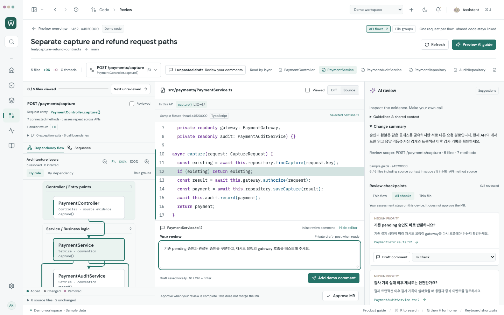
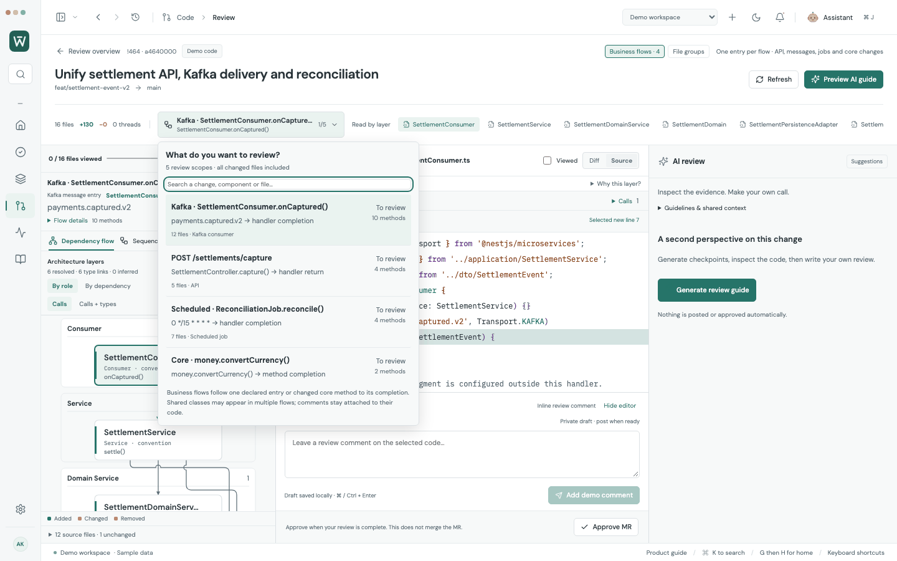
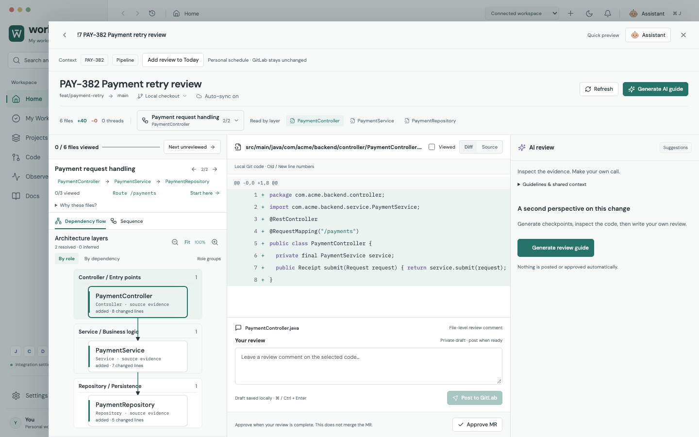
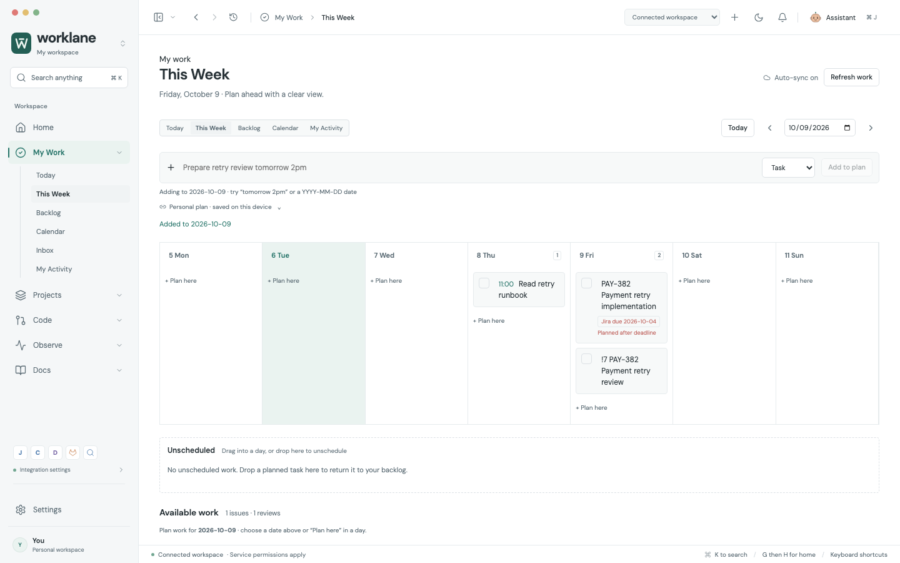
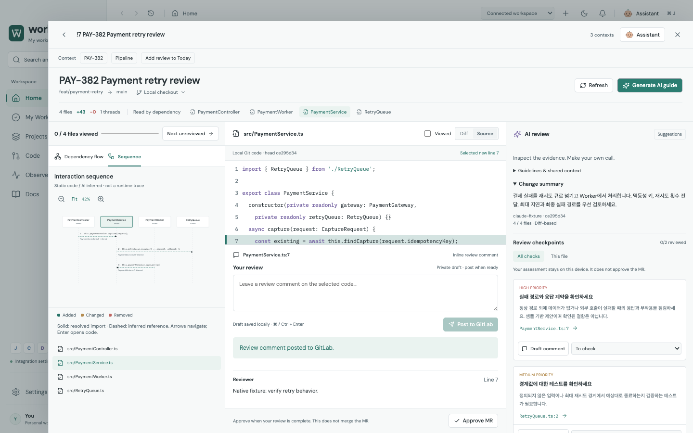

<div align="center">

# Worklane

**Your workday, connected.**

An Electron workspace for developers. Follow an issue across tools, understand a code change through diagrams, and return to your day.

  

[](https://github.com/benny1020/worklane/actions/workflows/quality.yml)

[Quick start](#quick-start) · [Visual review](#review-the-change-not-just-the-files) · [Integrations](#integrations) · [Screenshots](docs/SCREENSHOTS.md) · [한국어 설정 안내](docs/INTEGRATIONS_AND_REVIEW.md)

</div>


Worklane connects daily planning, Jira issues, Confluence documents, GitLab reviews and a contextual Claude assistant. Open related work in an inspector, follow its context, and return to the same list.

> **Early preview.** Includes a fully clickable demo and an Electron connected mode. All images and GIFs use synthetic sample data. Connected-mode recordings use test service responses, including the AI guide — they do not demonstrate a live company connection.

## Review the change, not just the files

Keep the **dependency or sequence diagram**, **code**, and **AI review** together. Select an AI checkpoint to highlight its component and exact diff line, inspect the evidence, then write your own review in the same workspace.


**Review one API from request entry to handler return.** Shared classes appear in each API with that API’s methods; code-line drafts stay shared, while API completion stays independent. Local immutable Git sources supply unchanged connector code, and the Claude guide uses the selected method ranges. Unsupported and unlinked changes remain available in file groups.



Try **!452** in the demo. [API flow behavior, screenshots, supported parsers and validation](docs/API_FLOW_REVIEW.md).

**API, Kafka, scheduled jobs and core changes share the same business-flow review.** Try **!464** to follow a settlement event through application/domain logic, persistence and message dispatch, then switch to the API, reconciliation or standalone currency scope. Data contracts open beside the current code and remain separate from execution.



[Business-flow support, layer evidence, screenshots and verification](docs/BUSINESS_FLOW_REVIEW.md).

Diagrams open with **Calls**; reveal **Calls + types** when inspecting contracts. Independent rounded rails avoid shared trunks, use fixed arrowheads, and retain exact source navigation and drafts. [Arrow routing, before/after screenshots and verification](docs/ARROW_ROUTING_REVIEW.md).

- Role-based architecture bands: Controller/Consumer/Job → Service → Domain Service/Domain → Adapter/Persistence Adapter → Repository/Producer, with ports, DTOs, entities, models and mappers distinguished. Naming, package conventions and source evidence remain inspectable. Switch to import-depth layout when useful; unknown roles stay explicit.
- Fallback file groups such as **Payment request handling** and **Order request handling**, with import reading paths and grouping evidence. Large file groups get numbered parts; a traced API stays one flow, and shared code keeps one draft. [Architecture and source reference](docs/REVIEW_ARCHITECTURE.md).
- Complete changed-file navigation, including files beyond the initial patch budget. Opening a deferred flow reads its diffs from local Git. [Grouping, coverage and validation](docs/REVIEW_FLOWS.md).
- Source-backed **transaction scopes** in sequence review: named TX regions, inside/outside indicators and exact start/end code links that preserve your draft. [Supported source patterns and validation](docs/TRANSACTION_REVIEW.md).
- Automatic diagram fit, keyboard navigation and layouts that adapt beside the assistant.
- Code and diffs come from an app-managed local Git repository and isolated MR checkout. File browsing makes no GitLab code API requests. New revisions are fetched automatically and staged without replacing the code you are reviewing.
- Old/new diff positions and commit SHA checks before posting comments or approving.
- Per-file **Viewed** state, commit-scoped progress, and **Next unreviewed** navigation.
- Per-file and per-line local drafts, retained after failed submissions and edits during posting.
- Persistent, on-demand Claude review beside the diagram and code, with cited checkpoints and reading order.
- Bring a suggestion into your local draft without replacing your own text; edit it before explicitly posting.
- Mark checkpoints **Checked** or **Not relevant** locally, independently of file progress and MR approval.
- Explicit review approval; Worklane does not merge the MR.

Solid dependency edges represent resolved source calls or imports. Dotted contract links show data structure; dashed messages indicate inferred/deferred interactions. These are **not runtime traces or a complete repository analysis**.



Try **Demo workspace → Code → !428 → Review** for a larger example: 30 changed files spanning capture retries, webhook ordering and settlement reconciliation, with shared infrastructure and code-linked sample review questions. Large sequences offer readable step-by-step navigation; a PR-wide draft menu resumes exact code positions, and the composer folds for more reading space. [Complex PR walkthrough and screenshots](docs/COMPLEX_PR_DEMO.md).

Diff and Source use [IDE-style syntax and rainbow bracket colors](docs/CODE_READABILITY.md), with language-aware highlighting, 12px code typography and contrasting light/dark palettes.

## Follow the work across tools

**Issue → wiki → merge request → pipeline → back to your day.** Related items open in a context stack, preserving the original workspace.


Connected Jira, GitLab and Confluence views **sync automatically** every minute while visible, when returning after a stale interval, after a relevant change, and on reconnect. Failed reads keep the last data and retry with backoff; drafts, applied filters and loaded pages stay intact. New MR revisions are prepared locally, then offered with **Review new revision** so the code cannot move beneath an unfinished review. [Synchronization behavior and validation](docs/AUTO_SYNC.md).

Related MR and wiki candidates appear directly in the issue inspector. Documents include a heading outline and issue references; pipeline failures can be filtered and focused without abandoning the MR. Issue-key matches are candidates, not automatically verified relationships.

The assistant keeps work-item conversations separate while recalling relevant knowledge across your connected profile. Completed exchanges and saved knowledge survive desktop restarts in encrypted storage; unfinished drafts stay in the current app session.

## A companion that remembers

Keep Claude docked beside your work or expand it into a spacious assistant workspace. Inspect the memories behind an answer, refine what it knows, and confirm proposed task changes before they happen.


- Encrypted conversation history and user-sourced knowledge, with search, editing, pause and forgetting.
- Source disclosure for recalled knowledge; bounded retrieval instead of sending the whole archive.
- Explicit confirmation for local task changes and scheduled reminders.
- A quiet Home brief built from the same personal plan, without background model calls.
- Opt-in desktop notifications while Worklane runs, with overdue reminders caught up on reopening.

The original robot avatar is Worklane's companion, not an official Claude character. This is a local desktop assistant, not an always-running cloud agent. Read the [memory design and limits](docs/ASSISTANT_MEMORY.md) and [GitHub source research](research/ASSISTANT_MEMORY_REPOS.md).

## Plan once, use every view

Today, This Week, Backlog and Calendar share **one local task dataset**. Add a real Jira issue or review to your plan, reorder it, schedule it, and move unfinished work to tomorrow.


- Quick add: `Prepare deployment review tomorrow 2pm`, with the parsed title, date and time visible before saving.
- Searchable backlog with completed work folded away; schedule only the shown unfinished items, with guarded undo.
- Linked issues and reviews show their planned date. Moving an existing task is explicit and reversible, without duplicates.
- Personal tasks and events, with Day / Week / Month calendar views.
- Drag-to-schedule, keyboard reordering, and editable linked personal plans.
- Click a calendar date to focus quick add without losing the current month.
- A clear next review from real requests, daily planning summaries and undo for local task deletion.
- Review requests and imminent deadlines collected in an attention center.
- Earlier unfinished tasks with original dates, one-click carryover and guarded undo.
- Day drilldown with a return to the exact calendar range; meetings stay put when unfinished tasks move.
- Global search across local tasks, Jira, GitLab and Confluence, with progressive results and per-service retry.
- Separate quick-create text drafts survive closing the palette during the app session.

Personal planning changes stay local. Checking a task or moving its date does **not** change a Jira status or deadline.

Jira issue search supports project, personal work, due-soon and active-sprint filters without writing JQL. Sprint planning selects a Scrum board and a specific active/future sprint or the board's backlog. Status changes are available inline; the inspector retains comment and field drafts when changing views. Required transition screens offer an explicit Open in Jira recovery action. [Jira usability](docs/JIRA_USABILITY.md) · [Planning usability](docs/TODO_USABILITY.md).

Daily and weekly planning surface every loaded review request, show Jira deadline conflicts, and share canonical linked tasks with guarded undo. Exact loaded Jira keys in quick entry schedule the existing work. [Practical review: three rounds](docs/PLANNING_PRACTICAL_REVIEW.md).



<details>
<summary><strong>More screens: dark mode, calendar, wiki and contextual assistant</strong></summary>

### Start with the day


### Explore the workflows


### Dark workspace


### Month at a glance


### Local source, connected review


### Contextual assistant


### Issue evidence at hand


### Read with context


### Wiki without losing the issue


</details>

## Quick start

You need Node.js 22 or newer and npm, plus Git on your PATH for connected repository review. Native desktop validation has been performed on macOS; Windows and Linux have not yet been validated.

```sh
git clone https://github.com/benny1020/worklane.git
cd worklane
npm ci
```

**Try the browser demo — no accounts or tokens required:**

```sh
npm run dev -- --port 5178
```

Open [localhost:5178](http://localhost:5178). Demo workspace contains realistic sample issues, reviews, documents and logs.

**Run the desktop app:**

```sh
npm run desktop
```

For live data, open **Settings → Integrations**, enter each service's URL and credentials, then select **Connected workspace**. Browser demo mode does not store integration tokens.

There are no signed installers or automatic updates yet. The desktop command builds and starts Electron from source.

## Integrations

| Service | Configuration | Implemented |
| --- | --- | --- |
| Jira Cloud | Site URL, account email, API token; optional Cloud ID | JQL, issue previews, status, assignee, priority, due date, sprint changes, comments, issue creation |
| Confluence Cloud | Separate site URL, email, API token; optional Cloud ID | Spaces, pages, search, recent/favorites, plain-text document publication |
| GitLab Self-Managed | Instance URL, personal access token with repository-read access | Local Git checkouts/diffs/source; MR/review lists, discussions, approvals, pipelines and jobs |
| Claude / Anthropic-compatible API | Endpoint URL, token, model ID; optional workspace ID | Model discovery, contextual assistant, durable memory, confirmed local task/reminder suggestions, structured MR review guides |
| Dooray | Menu placeholder | No API integration |
| Observe / OpenSearch | Interactive demo | Mock screens only |

Endpoints are user-configurable. Nothing is hardcoded to a company domain. Service permissions, configured workflows and available API versions determine which actions succeed.

For details and limits, see the [integration and review guide](docs/INTEGRATIONS_AND_REVIEW.md).

## Keyboard first, mouse friendly

| Shortcut | Action |
| --- | --- |
| `Cmd/Ctrl K` | Search / command palette |
| `Cmd/Ctrl N` | Quick create |
| `Cmd/Ctrl J` | Contextual assistant |
| `G`, then `H` / `M` / `P` / `C` / `O` | Home / My Work / Projects / Code / Observe |
| `Esc` | Close the active overlay |

The Home workflow guide opens real sample workflows in one click. Every global action also has a visible button. The top-left sidebar control switches between expanded navigation and icons; its menu also hides navigation completely. **Cmd/Ctrl + \\** hides/restores the previous layout, and the app remembers the choice after restart. Light/dark themes, recent objects and navigation history support longer work sessions.

## Data and execution boundaries

- Integration settings and tokens are encrypted with Electron `safeStorage`. Plaintext fallback is rejected; tokens are not returned to the renderer or stored in localStorage.
- Personal plans, recent items, favorites and review drafts are **local, unencrypted application data**. App-managed Git objects, worktrees and diff caches are also ordinary local repository data. There is no cross-device sync.
- Git credentials are provided only to the fetch process, never stored in clone URLs/config. Worklane checks out the MR branch’s exact commit in its own worktree; it never resets your existing development checkout. See [local Git review](docs/LOCAL_GIT_REVIEW.md).
- Service calls pass through a fixed Electron IPC action list. The renderer cannot request arbitrary URLs or run shell commands.
- Remote wiki HTML is sanitized. Embedded external navigation and active content are blocked. The explicit Jira recovery button opens only a validated issue browse URL at the configured HTTPS site in the system browser.
- AI review runs only on request. Its submitted context includes bounded MR diffs and your guidelines. Assistant requests include the selected work, personal plan, up to three completed exchanges and bounded recalled memory. Memory and completed chats are OS-encrypted; the browser demo uses session-only conversations. Selecting source sends a bounded excerpt around that line with its commit SHA.
- External writes use explicit submission buttons. Assistant task and reminder suggestions require confirmation before changing the personal plan or creating a reminder.

Real organization endpoints and credentials have not been validated in the published test run. Do not interpret fixture tests as production integration certification.

## Development and verification

```sh
npx playwright install chromium
npm test                        # Browser workflows
npm run test:adapters            # API contracts and safeguards
npm run test:desktop             # Native Electron encrypted vault
npm run test:connected-desktop   # Native UI → IPC → service adapters
npm run test:assistant-memory-desktop # Encrypted memory across native restarts
npm run build                   # Production renderer build
```

Latest validation: **301 browser tests**, **119 adapter/model tests** and **11 native connected workflow checks** passed in the [repeated large-PR usability audit](docs/LARGE_PR_REVIEW_AUDIT.md). Native profile compatibility, encrypted-vault checks and production build also passed. Native checks use an isolated profile, real temporary Git repositories and HTTPS protocol fixtures; no real company records are modified. Earlier memory lifecycle checks and planning reviews are recorded in [the practical planning review](docs/PLANNING_PRACTICAL_REVIEW.md) and [validation history](docs/LOCAL_DEVELOPMENT.md).

The subsequent [code readability follow-up](docs/CODE_READABILITY.md) passed **42 affected browser checks**, **124 adapter/model checks** and **11 native connected workflows**, plus production build. It did not rerun the complete browser suite.

```text
src/components/     Connected planning, commands, inspectors and review UI
src/lib/            Planning state, diff positions and graph/reference models
electron/           Main process, restricted preload bridge and API adapters
tests/              Browser workflows, adapter contracts and synthetic fixtures
scripts/            Native validation, screenshots and README recordings
docs/               Configuration, validation and curated media
```

See [CONTRIBUTING.md](CONTRIBUTING.md) for a focused contribution workflow and [media notes](docs/media/README.md) for reproducing these recordings.

## Current limits

Background synchronization, offline external writes, rich-text editing of existing Confluence pages, signed distribution, and full-repository AST analysis are not implemented. Some project-specific required Jira fields are intentionally rejected rather than silently omitted. Resource caps and partial-result behavior are documented in the integration guide.

## References and licensing

Interaction patterns were studied in cmdk, Radix, Plane, Huly, GitLab, Grafana, PR Lens and Microsoft’s VS Code Pull Requests extension. Worklane uses its own application UI; it is not a wholesale copy of those projects. [Source review notes](research/SOURCE_REVIEW.md) and [review-progress references](docs/REVIEW_REFERENCES.md) record inspected commits, line ranges and what was adopted. The latest [workflow convenience review](docs/WORKFLOW_CONVENIENCE.md) records reproduced defects, independent review and validation.

DM Sans and IBM Plex Mono are bundled locally under their SIL Open Font Licenses; the app makes no external font requests. Dependencies retain their respective licenses. **No project-wide license has been selected for Worklane yet**; making this repository public does not grant a new open-source license.
