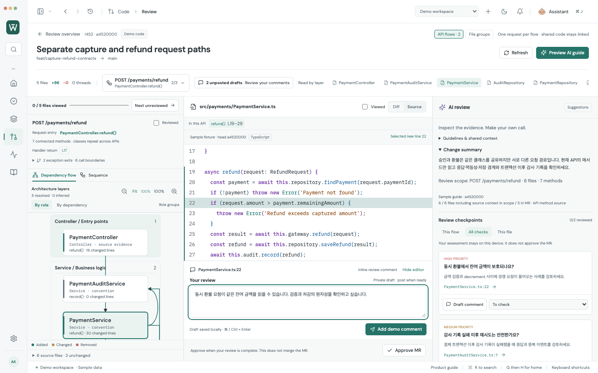

# API별 비즈니스 흐름 리뷰

2026-10-07. 리뷰 기본 단위를 **API 진입 메서드 → 호출되는 메서드 → handler return**으로 바꿨습니다. 같은 Controller·Service·Repository를 승인 API와 환불 API에서 반복해서 보여주되, 각 다이어그램에는 해당 API에서 연결되는 메서드만 포함합니다.


## 직접 사용하기

Demo workspace → Code → **!452 Separate capture and refund request paths** → Review.

1. 기본 `POST /payments/capture`에서 PaymentService를 열면 `capture()` 범위로 이동합니다. 메서드 범위에 왼쪽 표시가 있고, 원본 파일 전체와 정확한 행 번호는 유지합니다.
2. 상단 흐름 선택에서 `POST /payments/refund`를 고릅니다. 같은 클래스가 다시 나타나지만 `refund / findPayment / saveRefund`를 읽습니다.
3. `PaymentAuditService.record()`는 수정되지 않은 공통 코드입니다. 어느 API에서 작성해도 동일한 파일·행의 댓글 초안이 유지됩니다.
4. `Reviewed`는 **현재 API 하나**에만 적용됩니다. 파일의 `Viewed` 표시와 분리되어 다른 API를 자동으로 완료하지 않습니다.
5. `Preview AI guide`는 현재 API의 샘플 질문만 표시합니다. 연결 모드의 `Generate AI guide`는 해당 API의 메서드 코드와 공통 컨텍스트를 Claude에 보냅니다.
6. API로 연결되지 않은 문서·설정·테스트·나머지 변경은 `Other changes`에서 검토합니다. `File groups`로 기존 보기도 사용할 수 있습니다.



Home이나 다른 MR을 열었다 돌아오면 선택한 API, 파일, Source 모드, 행 번호, AI 가이드와 초안을 복원합니다. 완료 상태는 정확한 MR diff refs별로 저장합니다. 새로운 revision으로 자동 이동하지 않습니다.

## 무엇을 근거로 나누나

- TypeScript/JavaScript는 **Babel AST**, Java는 **java-parser CST**로 읽습니다. 파일명이나 AI가 만들어낸 호출 관계로 API를 확정하지 않습니다.
- 현재 지원하는 진입점은 NestJS의 직접 import된 `Controller`와 HTTP 메서드 데코레이터, Spring의 import된 `Controller/RestController`와 `RequestMapping/*Mapping`입니다. 리터럴 route를 사용하며 NestJS import alias도 지원합니다.
- 선언된 필드/constructor type, 상대 import 또는 Java package/import, 메서드 이름과 인자 수로 대상이 하나로 좁혀지는 호출을 연결합니다. 자기 클래스의 명시적 메서드 호출도 추적합니다.
- 조건부 호출, return/throw 위치, 재귀, 콜백과 큐 dispatch의 경계를 원본 행에 연결합니다. 알 수 없는 대상은 경계 목록에서 열 수 있습니다.
- 변경된 하위 메서드에 도달하는 **수정되지 않은 API 진입점**도 찾습니다. 메서드 내부 삭제와 import/필드 변경은 보수적으로 영향 범위에 포함합니다.
- 한 API가 12개 파일을 넘더라도 임의로 분할하지 않습니다. 분석 상한에 도달하면 부분 분석임을 표시합니다.
- API 다이어그램은 이 분석 결과를 사용합니다. AI 가이드는 질문과 읽기 순서를 제안하며, API 다이어그램의 연결을 추가하지 않습니다.

Sequence는 정적으로 확인한 호출 위치를 읽는 도구입니다. 조건 분기의 실제 선택, 반복 횟수, 콜백 실행, 런타임 dispatch, 트랜잭션 commit/rollback을 증명하는 실행 trace가 아닙니다. 기존 transaction scope 표시는 같은 원본 소스의 선언을 사용합니다.

## 로컬 Git과 댓글

연결 모드에서는 이미 확보한 immutable head와 base의 Git object를 읽습니다. 변경 파일과 주변의 수정되지 않은 코드를 `ls-tree`와 `cat-file --batch`로 읽고, 계정·프로젝트·revision별로 캐시합니다. API 분석 때문에 fetch하거나 GitLab raw/diff 코드 API를 호출하지 않습니다.

분석용 source index는 **500개 파일, 총 4 MiB, 파일당 200 kB**로 제한하며 변경 파일과 Controller/route 파일을 우선합니다. regular Git blob만 포함하고 심볼릭 링크·submodule·binary는 제외합니다. API 하나는 최대 200개 메서드와 500개 확인된 호출 위치를 확장합니다. 누락·parse 실패·확장 제한은 부분 분석으로 표시하며, MR 변경 파일 목록은 계속 별도로 남습니다.

변경되지 않은 코드에는 diff position을 만들지 않습니다. 실제 source 행을 확인한 뒤 `파일:행 @ head`를 포함한 **MR-level comment**를 작성합니다. 현재 head/base/start 확인과 사용자의 명시적 Post 동작은 기존과 동일합니다.

현재 지원하지 않는 동적 route, route 배열, Express/FastAPI/Go/Kotlin 진입점, inheritance/interface dispatch, barrel/path-alias import, receiver chaining, 일부 overload와 callback 실행 순서는 확정하지 않습니다. 같은 파일의 import 없는 다른 클래스 타입도 경계로 남습니다. 이 경우 원본 코드와 파일 묶음을 사용하며, 누락 없는 전체 프로그램 분석을 주장하지 않습니다.

## 검증

최종 production build 및 whitespace 검증 통과:

| 검증 | 결과 |
| --- | --- |
| 전체 브라우저 회귀 | **316/316** |
| adapter/model/실제 Git 테스트 | **152/152** |
| 기존 native connected workflow | **11/11** |
| 새 API native connected workflow | **6/6** |
| native profile upgrade / encrypted vault | 통과 |
| production Electron module worker / API별 메서드 분리 | 통과 |
| 실제 UI 캡처 | 5장, page error 0 |
| production dependency audit | vulnerability 0 |

새 브라우저 테스트 9개는 메서드 분리, 공통 코드 초안, 독립적인 완료 상태, AI 범위, 미연결 문서, 메뉴 복귀, 1440×900 및 980×650의 양쪽 테마를 확인합니다. 작은 창에서는 세 영역을 나란히 유지합니다. 진입점/응답 위치와 다이어그램 컨트롤은 스크롤에 사라지지 않고, 상세 호출 경계와 파일 목록은 팝오버로 펼칩니다.

Native 검증은 실제 Electron·preload·main adapter·임시 Git repository/worktree를 사용합니다. 새 API 테스트에서는 수정되지 않은 Service를 base부터 유지한 뒤 실제 commit으로 새 Controller를 추가하고, 댓글과 Claude 요청을 synthetic HTTPS 응답으로 검증했습니다. **회사 계정, production records, 실제 Claude 답변의 품질은 검증하지 않았습니다.** 기존 11개 native 시나리오에서는 71개 metadata 요청, 원격 코드 API 요청 0, renderer error 0, 자동 외부 write 0이 기록됐습니다.

검토 중 수정한 문제: 다른 API 메서드가 섞이는 파일 기반 scope, 같은 파일의 Viewed가 다른 API를 완료하는 문제, 삭제만 있는 메서드 영향 누락, callback return을 handler return처럼 취급하는 문제, 원본 행 draft/메뉴 복귀 상태 손실, source 컨텍스트의 잘못된 inline position, 좁은 창에서 API 컨텍스트와 다이어그램 컨트롤이 사라지는 문제. 지원 범위 내에서 이 재현 사례의 회귀 검증을 완료했습니다.

재현 명령:

```sh
npm run build
npm run test:adapters
npm test -- --workers=5
npm run test:desktop
npm run test:connected-desktop
npm run test:api-flow-desktop
npm run dev -- --port 5178
# 별도 터미널, dev server 실행 중
node scripts/capture-api-flow-review.mjs
# 선택: Pillow가 설치된 Python
python3 scripts/encode-api-review-gif.py
```

API 분석은 [review-api-flows.mjs](../src/lib/review-api-flows.mjs), 로컬 index는 [local-git.cjs](../electron/local-git.cjs), API별 Claude 범위와 댓글 처리는 [integrations.cjs](../electron/integrations.cjs), UI는 [ReviewWorkbench.jsx](../src/components/ReviewWorkbench.jsx)에 있습니다.

## 파서 출처와 라이선스

외부 PR 리뷰 제품의 구현을 복사한 기능이 아닙니다. 아래 파서를 dependency로 사용하고 API 추적·캐시·UI·검증 코드는 Worklane에서 작성했습니다.

| Dependency | 고정 버전 | 출처 / 라이선스 |
| --- | --- | --- |
| @babel/parser | 7.29.9 | [공식 Babel parser 문서](https://babeljs.io/docs/babel-parser), [MIT 원문](licenses/babel-parser-MIT.txt) |
| java-parser | 3.0.1 | [Java parser source](https://github.com/jhipster/prettier-java/tree/main/packages/java-parser), [Apache 2.0 원문](licenses/java-parser-Apache-2.0.txt) |
| Chevrotain | 11.2.0 override | [공식 source](https://github.com/Chevrotain/chevrotain), [Apache 2.0 원문](licenses/chevrotain-Apache-2.0.txt) |
| lodash / lodash-es | 4.18.1 overrides | [공식 source](https://github.com/lodash/lodash), [lodash MIT](licenses/lodash-MIT.txt), [lodash-es MIT](licenses/lodash-es-MIT.txt) |

Overrides는 파서의 동일 major 의존성을 고정합니다. 위 parser·Java 사례는 이 조합으로 테스트했습니다. 전체 upstream 저장소를 모든 줄 감사했다는 의미는 아닙니다.
