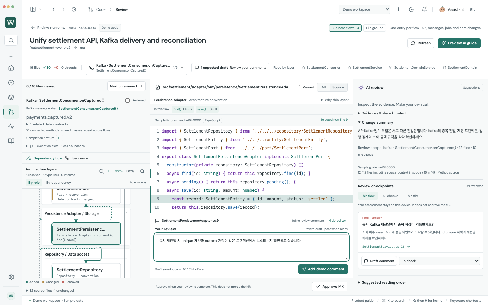
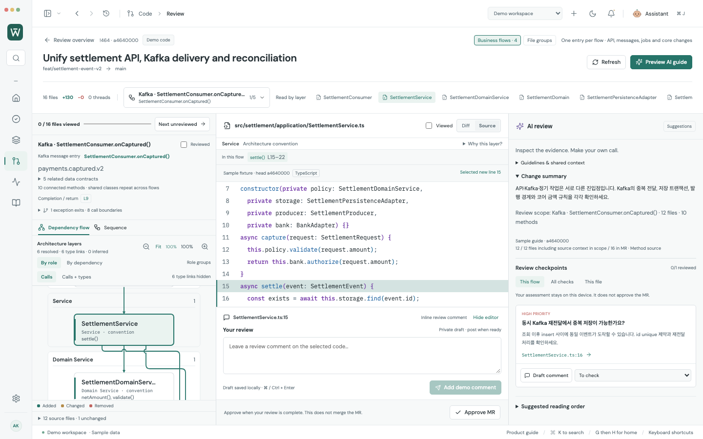

# Review arrows: calls first, independent rails

2026-10-07. Re-read the actual connector rules and architecture examples in [cathrynlavery/diagram-design](https://github.com/cathrynlavery/diagram-design/tree/d1376371965f513d99cc9ec388835d255c5c88d5), pinned at `d1376371965f513d99cc9ec388835d255c5c88d5`.

## What changed

The mixed settlement PR previously put six resolved call links and six type references into the same narrow diagram. Ports, DTOs, entities and models created long reverse reference rails around the application, domain and storage layers. A lower overlap cost still allowed two connectors to occupy the same trunk.

- **Calls** is now the default. The Kafka example shows seven executable components and six call links. **Calls + types** restores all twelve components and twelve links. The count of folded type links stays visible; related contracts remain available beside the source. Selecting a contract keeps its node available even in Calls mode. This is a presentation filter; the original source graph, sequence, Claude scope and review coordinates stay intact.
- A shared trunk is now forbidden. Routing reserves the perpendicular approach to **every** endpoint before drawing the first connection, so an early long rail cannot block a later arrow's port. Grid and side lanes provide alternate routes; crowded layouts get additional gutters and row spacing.
- Short links are routed first, before passive type references. A necessary crossing gets a bridge on the later connector. Adjacent layers can use a straight vertical connection; skipped ranks route around components. Layer captions use concise role names with matching obstacle bounds.
- Ordinary source selection reuses route geometry; only the highlight changes, avoiding a fresh routing pass on every component click.
- Arrowheads have a fixed size in diagram coordinates, so selection does not enlarge them. Only the current component and its related connections use the accent.
- If bounded routing cannot place a connection, its exact source link is available in an expandable list, instead of painting overlapping strokes or dropping the relationship silently.

These changes follow [connector rules 1–6](https://github.com/cathrynlavery/diagram-design/blob/d1376371965f513d99cc9ec388835d255c5c88d5/skills/diagram-design/references/primitives-core.md) and [architecture direction/port/crossing rules](https://github.com/cathrynlavery/diagram-design/blob/d1376371965f513d99cc9ec388835d255c5c88d5/skills/diagram-design/references/type-architecture.md). Worklane keeps its own React/SVG implementation, typography and palette; no upstream templates, scripts or new packages are copied.

## Actual app captures

Before — calls and type references mixed together:



After — source call into storage, followed by a direct repository connection:


Service branch inspection, with related rails highlighted:




Seven captures were regenerated using an isolated Chromium instance, with zero page errors. They use synthetic MR !464 and a sample AI guide; company services and live Claude response quality remain unverified. The README GIF contains actual unchanged app frames.

## Current verification

- Browser: **328/328** full regression; **18/18** focused screen checks repeated after the final route-reuse/empty-view refinements.
- Adapter/model/Git: **168/168**.
- Production build, profile compatibility, vault/settings checks and production parser-worker rendering: passed via `npm run test:desktop`.
- Production Electron + actual immutable Git + synthetic HTTPS metadata/Claude: **6/6** mixed-flow checks, zero renderer errors, zero remote code API requests or automatic external writes.
- Routing checks cover skipped layers, reverse arrows, self loops, fan-in, 30 components / 40 links, and both mixed Kafka presentation modes. They reject shared straight segments, off-axis paths, unrelated component collisions, missing links and altered source graph data.
- UI checks cover light/dark at 1440×900 and 980×650, keyboard source inspection, type-link disclosure and preservation of code line/draft.

Routing has an 80,000-state bound per connection. This is a static source graph, not a runtime trace. Point crossings may remain, with bridges where space allows; near corners/very close crossings do not receive a bridge. Arbitrarily large graphs cannot be guaranteed to fit without scrolling or source-link fallback.

```sh
npm test -- --workers=5
npm run test:adapters
npm run test:desktop
node scripts/test-business-flow-desktop.mjs
node scripts/capture-business-flow-review.mjs
```
