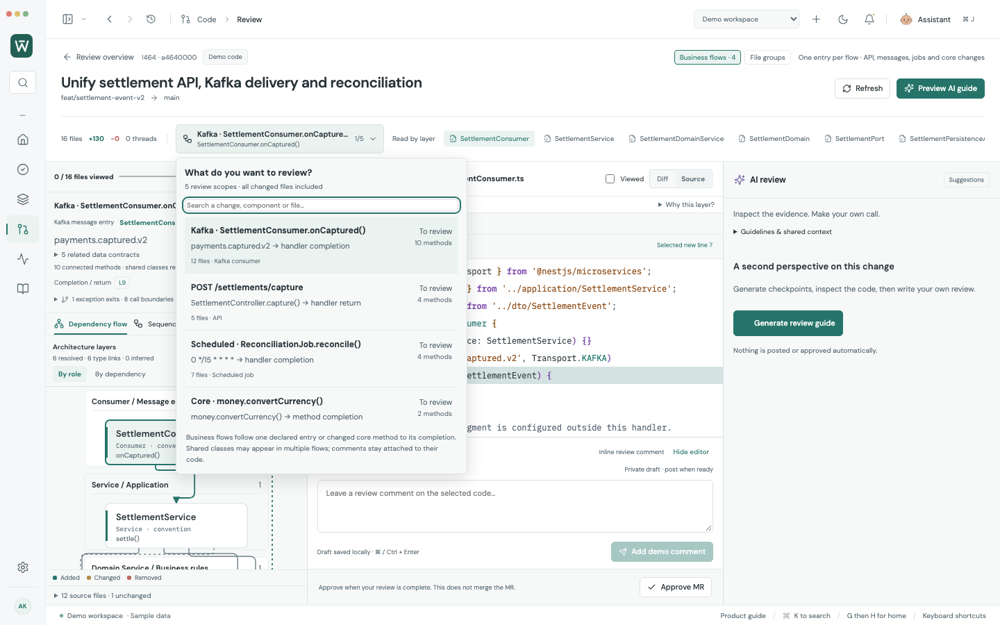
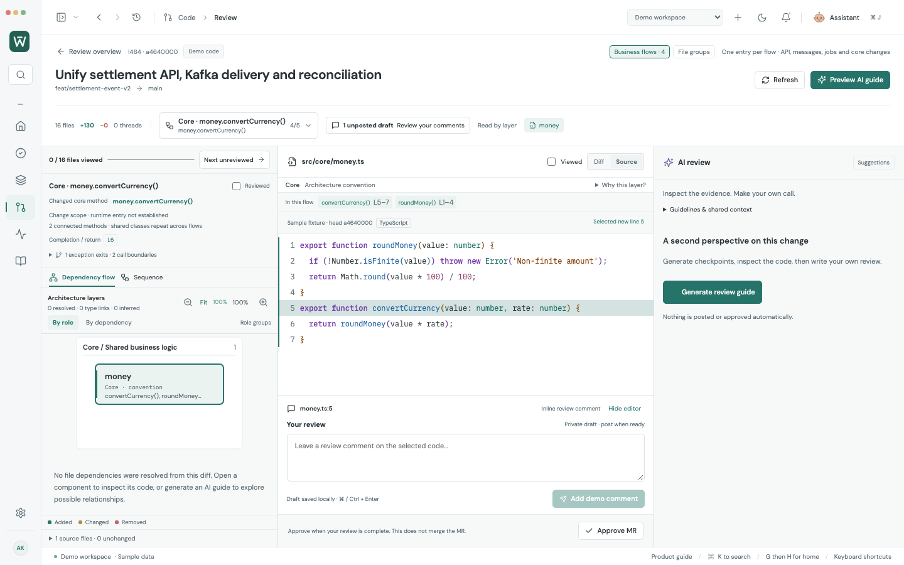
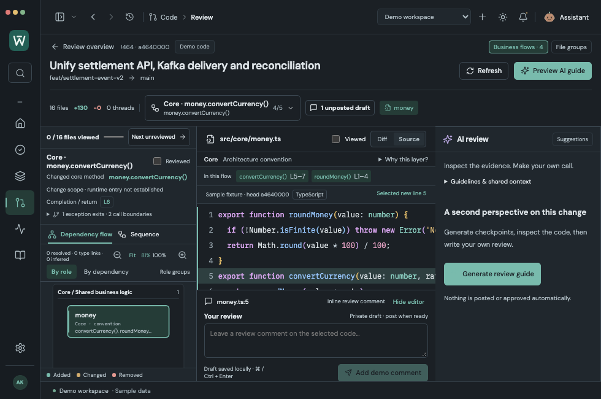

# Business-flow review and architectural layers

Worklane reviews a declared API, message handler, scheduled job or a changed core method in its own scope. Shared classes repeat in the flows that use them; each scope lists its own methods. All changed files remain reachable, including contracts, configuration, unsupported languages and source that cannot be traced.

Try **Demo workspace → Code → !464 → Review**. The synthetic settlement change (16 changed files and one unchanged domain context file) includes a Kafka consumer, an API, a reconciliation job, shared application/domain/storage code, DTOs/entities and standalone currency functions. The sample AI guide is not a live Claude response.

## Separate execution and data structure

- Dependency review shows architectural role bands. Solid call arrows use resolved source methods; dotted contract edges show imported data structure. Type imports do not become execution steps.
- Sequence review follows source calls and preserves transaction declarations and exact source locations. Publishing ends at a dispatch boundary; it never fabricates a broker-to-consumer execution chain.
- Related contracts expand on demand. A DTO, port, entity or model opens in the same code panel, with original source lines and comment drafts.
- **Why this layer?** discloses the classification evidence. Source declarations, naming/directory conventions, conflicts and unknown roles have different labels. Architectural ordering never creates call edges.
- Core scopes start at a changed method/function and its resolved callees. They explicitly say **runtime entry not established**. Unique upstream core callers are preferred to redundant helper scopes; recursion remains an explicit boundary.

## Recognized layer conventions

| Layer | Examples and signals |
| --- | --- |
| Controller | Controller, routes, request annotations |
| Consumer | Consumer, Listener, Subscriber, consumer/listener directories |
| Job | Job, Scheduler, Tasklet, Batch, Worker |
| Service | Application Service, UseCase, Interactor, application/services directories |
| Domain Service | DomainService or domain/service paths; refines a generic `@Service` |
| Domain | Objects in domain packages/directories |
| Core | Shared business functions in core directories |
| Port | Port interfaces and port directories |
| Adapter | Adapter or Adaptor, adapter/adaptor directories |
| Persistence Adapter | PersistenceAdapter, PersistentAdaptor, JpaAdapter, storage/database variants and adapter/out/persistence paths; refines generic service/repository declarations |
| Repository | Repository, Repo, DAO, data repository declarations, MyBatis Mapper |
| Producer | Producer, Publisher, Queue, EventBus |
| Integration | External Client and Gateway |
| DTO | DTO/Dto, Request, Response, Command, Query, Event, transfer contracts |
| Entity | Entity, entities directories, entity/table declarations |
| Model | Model, Schema, data structure directories |
| Mapper | Mapper, Converter, conversion directories; MyBatis mapper declarations classify as repositories |
| Support | UI, shared/utilities, tests, docs, configuration and explicit unclassified roles |

Specific conventions precede generic Service/Adapter names. Source annotations normally outrank conventions; generic service/repository stereotypes can be refined by specific domain/storage conventions. Conflicting annotations remain ambiguous. Classification describes source structure, not proof of a running framework or a DDD correctness judgment. An arbitrary class with no evidence stays unclassified; Worklane does not force it into a convenient layer.

## Source-backed trigger support

| Source | Supported roots |
| --- | --- |
| TypeScript / JavaScript | Nest HTTP verbs; imported Nest EventPattern/MessagePattern; explicit imported Transport.KAFKA distinguishes Kafka from other message transports; Nest Cron/Interval/Timeout; Bull Process; top-level functions and function/arrow declarations; class methods |
| Java | Spring request mappings; imported/qualified Spring KafkaListener; Scheduled; explicitly imported EventListener; changed class methods |
| Other cases | Changed-core method scopes where parseable, followed by explicit file groups for unsupported languages, dynamic callbacks, configuration, docs and unresolved changes |

Rules use official declarations: [Spring Kafka listeners](https://docs.spring.io/spring-kafka/reference/kafka/receiving-messages/listener-annotation.html), [Nest message/event patterns](https://docs.nestjs.com/microservices/basics), [Nest Kafka transport](https://docs.nestjs.com/microservices/kafka), [Nest scheduling](https://docs.nestjs.com/techniques/task-scheduling).

Lookalike decorators from another module do not create trusted triggers. A message pattern alone does not establish Kafka transport. Runtime-configured KafkaJS callbacks, Spring Batch configuration, reflection, polymorphic dispatch, Kotlin/Go/Python and custom frameworks are not completely analyzed. Their changes stay visible in source/core scopes or file groups; this is complete changed-file navigation, not universal execution tracing.

Calls resolve using explicit relative imports or Java package/import types, plus unique method name and arity. Ambiguous overloads, shadowed lexical names, dynamic/chained dispatch and unestablished callbacks remain boundaries. Runtime conditions, delivery/acknowledgment, scheduler locks, transaction propagation, commit/rollback and framework activation are not proven.

## Context and AI boundaries

Flow IDs are validated by the Electron main process against the current base/head and configured GitLab account. The renderer cannot select arbitrary source by sending a fabricated flow ID. The Claude payload includes the selected method ranges and related contracts, with unchanged code from the same immutable Git revision and bounded coverage. Sample guides use the same scope filter. AI suggestions cannot replace the source-derived topology.

Code-line drafts remain canonical across overlapping scopes. When a leaf component has several incoming method calls, selecting its source method focuses the nearest matching target call rather than the first class call. Returning from Home also restores unchanged source, the selected line and its draft for message/job/core scopes. Scope completion, file Viewed state, AI checkpoint assessments and MR approval are separate. Analysis temporarily disables guide generation so a guide cannot silently disappear when an initial fallback scope changes.

The local Git source index reads one immutable changed-file manifest, batch-reads regular source blobs, then compares exact base/head blob pairs. It does not repeatedly request GitLab code or reread the manifest per changed source. Account checks, file/source/diff budgets and unavailable-patch fallbacks remain enforced. The bounded index loads up to 500 supported source files / 4 MiB, with 200 kB per source file; partial coverage is labeled. Source patches retain the 2 MiB aggregate / 512 KiB individual limits.

## Validation — 2026-10-07

- **327/327 browser workflows**; including **11/11 affected diagram/business-flow checks** after polishing data-contract labels.
- **167/167 adapter/model/local Git checks**, including mixed root coverage, trusted trigger imports, lexical shadowing/type-only imports, individual method ranges, type relationships and layer conventions.
- **23/23 native connected checks**: 11 existing workflows, 6 API flows, 6 mixed business-flow checks. These use production Electron, actual temporary Git objects and synthetic HTTPS metadata/Claude responses.
- Production build, profile compatibility/encrypted-vault guards, production module worker, cold-start **2/2**, and whitespace checks passed.
- Five actual UI screenshots have **zero page errors**. Native fixtures report **zero renderer errors**, zero GitLab diff/raw source API requests and no automatic external writes.

The primary implementer performed this pass; no independent subagent review is claimed. Live organization services, production delivery semantics and live Claude review quality remain unverified. Existing personal browser-tab access was rejected by browser security policy; screenshots and UI checks use isolated test browsers and Electron profiles.
