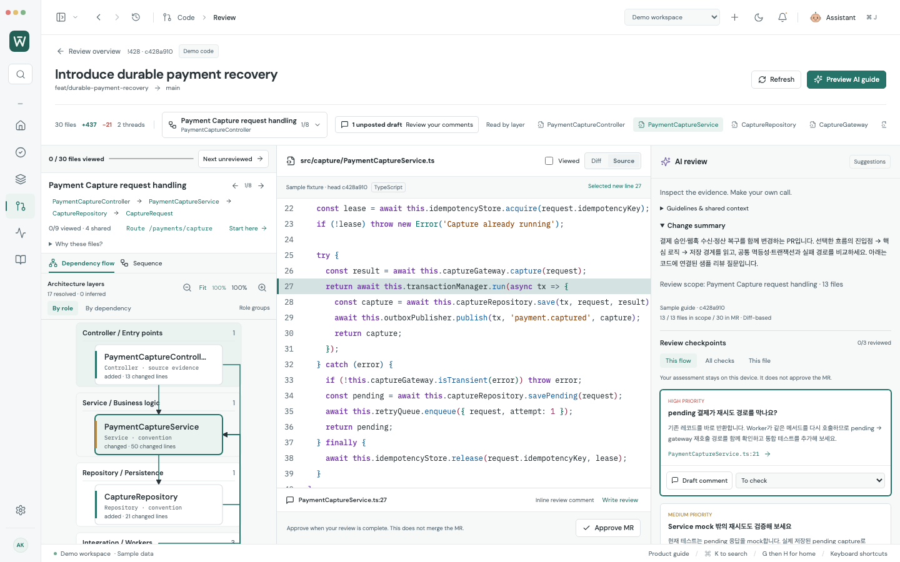
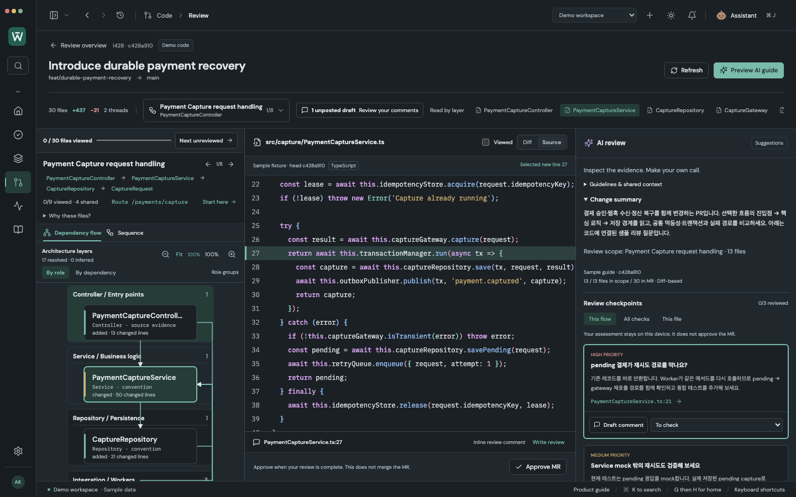

# IDE-style code readability — 2026-10-07

The MR review's Diff and Source views now use language-aware syntax colors and six repeating colors for nested bracket pairs. The font is 12px IBM Plex Mono with the existing 25px line spacing. Keyword, function, type, string, number and comment colors differ, and light/dark palettes retain the existing added, removed and selected-line backgrounds.

Syntax uses the token stream from [Prism 1.30.0](https://prismjs.com/extending) (MIT). Grammars are bundled locally for JavaScript/TypeScript/JSX/TSX, Java, Kotlin, Python, JSON, YAML, SQL, Shell, CSS, HTML/XML/SVG, Go and C#. There is no CDN request. Worklane's wrapper renders token text through React, rather than rendering generated HTML.

Brackets in comments, strings, regular expressions and YAML block scalars do not change code nesting. Whole-source tokenization retains multiline state. Diff old/new sides are tokenized independently, and hunk gaps reset partial context. When exact head source is already available, matching diff lines reuse its actual nesting; this never triggers an extra source request. Unknown languages and source strings over 200,000 characters remain exact plain text. These colors represent syntax, not compiler/type-checker semantic analysis.

Verification in this follow-up:

- **42/42 focused browser checks** passed: code text/line preservation, exact inline posting, large/small review navigation, draft/version safeguards, and light/dark/narrow layouts.
- All syntax/bracket palette colors meet **4.5:1 contrast** against actual plain, added, removed and selected code backgrounds in both themes.
- **124/124 adapter/model checks** passed, including five new multiline, literal, old/new nesting, language and plain-text fallback tests.
- **11/11 native connected workflows**, production build and whitespace checks passed; zero renderer console errors or automatic external writes. Remote responses use protocol fixtures and local code uses real temporary Git repositories.
- Eight actual 1440 × 900 screenshots captured with zero page errors. Reproduce with `node scripts/capture-complex-review.mjs` while Vite runs on port 5178.

The preceding full browser run was 301/301 in the [large-PR audit](LARGE_PR_REVIEW_AUDIT.md); this follow-up reran the 42 affected review checks. Live company services and Claude output quality are not exercised.
