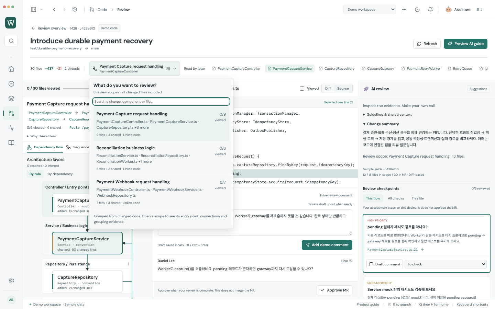
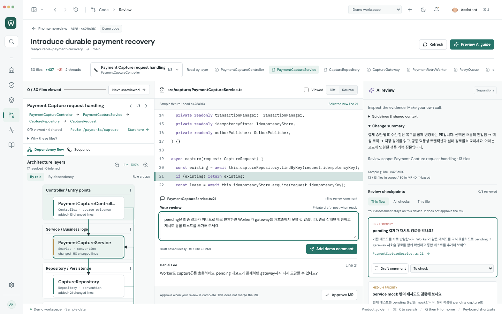
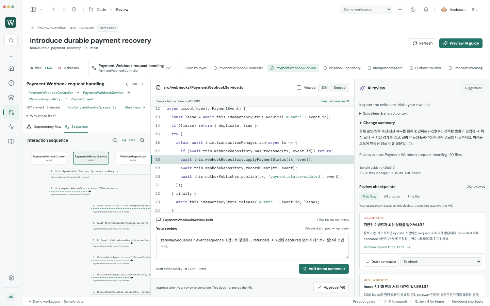
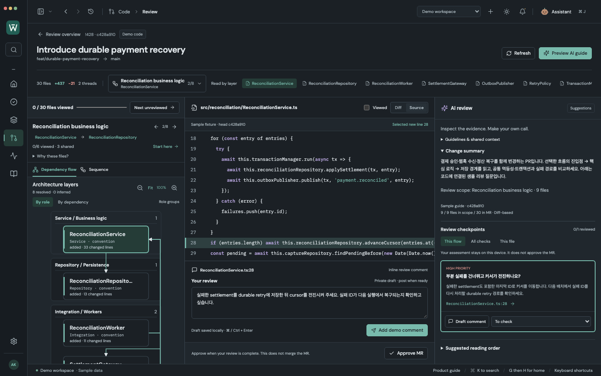

# Complex payment recovery review

In **Demo workspace → Code → Merge Requests**, open **!428 Introduce durable payment recovery → Review**.

This synthetic PR changes **30 files (+437 / −21)** across three connected areas:

| Review area | Primary files | Linked shared files | Review question |
| --- | ---: | ---: | --- |
| Payment capture | 9 | 4 | Does a persisted pending capture prevent the retry worker from reaching the gateway? |
| Settlement reconciliation | 6 | 3 | Can advancing the cursor skip a failed settlement? |
| Payment webhooks | 7 | 3 | Can an out-of-order event overwrite newer payment state? |

The remaining eight primary files cover four shared components, configuration, a DB migration, documentation and removal of the legacy polling worker. All 30 files have exactly one primary review scope; shared links do not duplicate progress or drafts. Connected changes appear first in the picker, followed by supporting scopes.

Source and diffs are authored sample strings, not a runnable payment backend or company code. The two existing discussion threads and five AI checkpoints are also authored fixtures. **Preview AI guide** makes no Claude request. Dependencies resolve real imports within the fixture; sequence arrows remain inferred static relationships, not a proven execution trace.

Select a component or checkpoint to inspect its code, select a line, and write a private review draft. Flow changes preserve drafts and scoped AI guides. Adding this sample to an existing demo profile preserves the other MRs and their statuses.

Reproduce the 1440 × 900 captures with `node scripts/capture-complex-review.mjs` while the development server runs on port 5178. The capture uses the actual app, selects source lines and fills private demo drafts; it does not modify styles for screenshots.

Validation: 282 browser tests (including 18 focused review tests), 111 adapter/model tests, production build, and four captures with zero page errors. Live GitLab and Claude connections are not exercised by this fixture.
