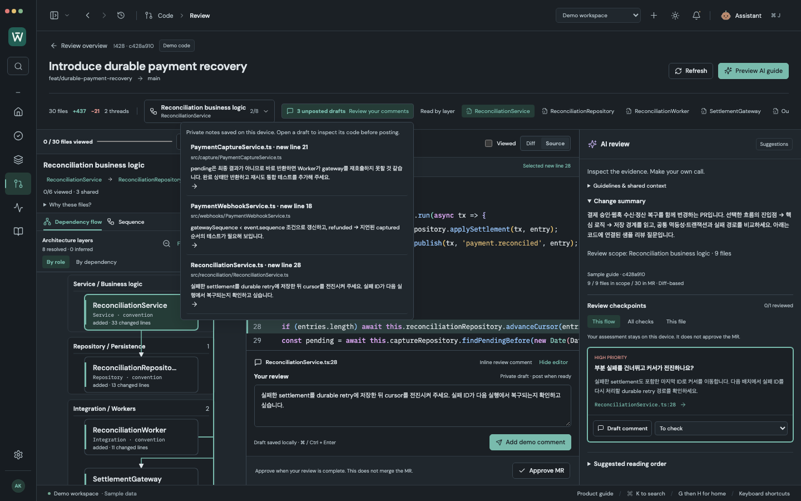
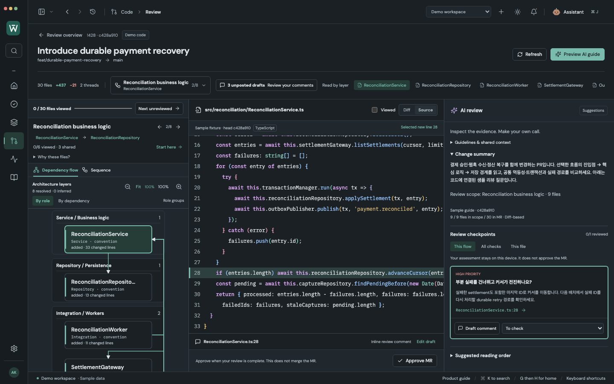

# Complex payment recovery review

In **Demo workspace → Code → Merge Requests**, open **!428 Introduce durable payment recovery → Review**.

This synthetic PR changes **30 files (+437 / −21)** across three connected areas:

| Review area | Primary files | Linked shared files | Review question |
| --- | ---: | ---: | --- |
| Payment capture | 9 | 4 | Does a persisted pending capture prevent the retry worker from reaching the gateway? |
| Settlement reconciliation | 6 | 3 | Can advancing the cursor skip a failed settlement? |
| Payment webhooks | 7 | 3 | Can an out-of-order event overwrite newer payment state? |

The remaining eight primary files cover four shared components, configuration, a DB migration, documentation and removal of the legacy polling worker. All 30 files have exactly one primary review scope; shared links do not duplicate progress or drafts. Connected changes appear first in the picker, followed by supporting scopes.

Source and diffs are authored sample strings, not a runnable payment backend or company code. The two existing discussion threads and five AI checkpoints are also authored fixtures. **Preview AI guide** makes no Claude request. Dependencies resolve real imports within the fixture; sequence arrows remain inferred static relationships, not a proven execution trace.

Select a component or checkpoint to inspect its code, select a line, and write a private review draft. Shared components keep the selected business flow. Flow changes and navigation to another tool preserve the selected file, line, diagram mode and scoped AI guide for the current app session; private drafts, viewed files and posted demo comments survive reload. Adding this sample to an existing demo profile preserves the other MRs and their statuses.

Large sequences default to **Step by step**: two participants, one source-linked call, previous/next buttons and a selector for every recognized interaction. **Whole flow** provides the broader overview; **100%** restores readable scale after Fit. These are source-order navigation aids, not a timeline of one execution. Type signatures, comments and quoted examples do not become calls, and generating an AI guide does not replace recognized static evidence.

Use **Review drafts** to resume a private note at its file, line and old/new side. Earlier old-side revisions remain available for reference. Approval shows viewed-file and unposted-draft counts and never posts drafts. **Hide editor** gives more space to code while keeping its draft intact; existing discussions expand on demand.

Sequence review also shows [declared transaction scopes](TRANSACTION_REVIEW.md): Capture save and Outbox sit inside L27–31, while the gateway request and lease release sit outside. Open the start/end directly without losing your current interaction or human review draft.

Diff and Source also provide [language-aware syntax and rainbow bracket colors](CODE_READABILITY.md), with light/dark palettes that remain readable on changed and selected lines.

Reproduce the 1440 × 900 captures with `node scripts/capture-complex-review.mjs` while the development server runs on port 5178. The capture uses the actual app, selects source lines and fills private demo drafts; it does not modify styles for screenshots.

Large-PR validation: 301 browser tests, 119 adapter/model tests, native profile/vault and 11 native connected checks, production build, and six captures with zero page errors. See [the repeated large-PR usability audit](LARGE_PR_REVIEW_AUDIT.md). The subsequent [code readability pass](CODE_READABILITY.md) verified 42 affected browser checks, 124 adapter/model checks, 11 native connected workflows and eight updated captures. Live GitLab and Claude connections are not exercised by this fixture.
