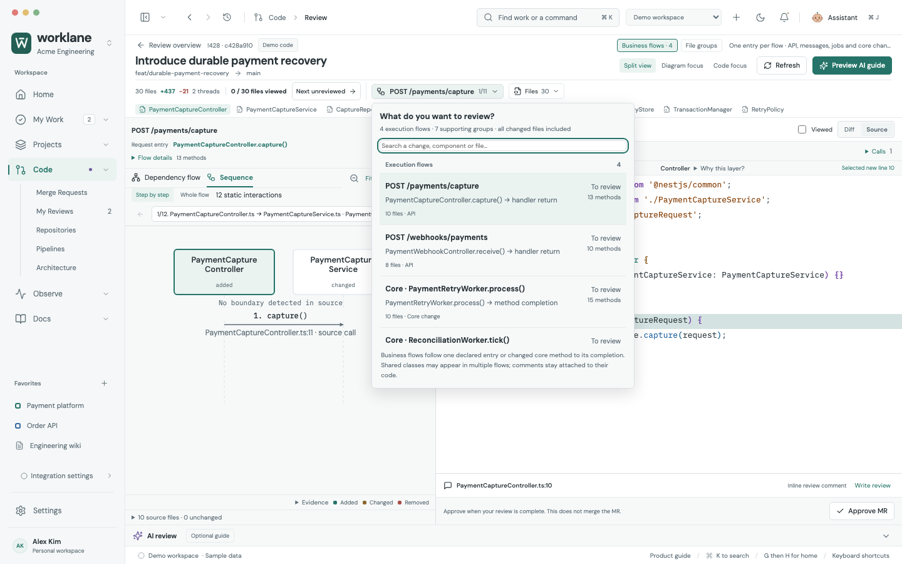
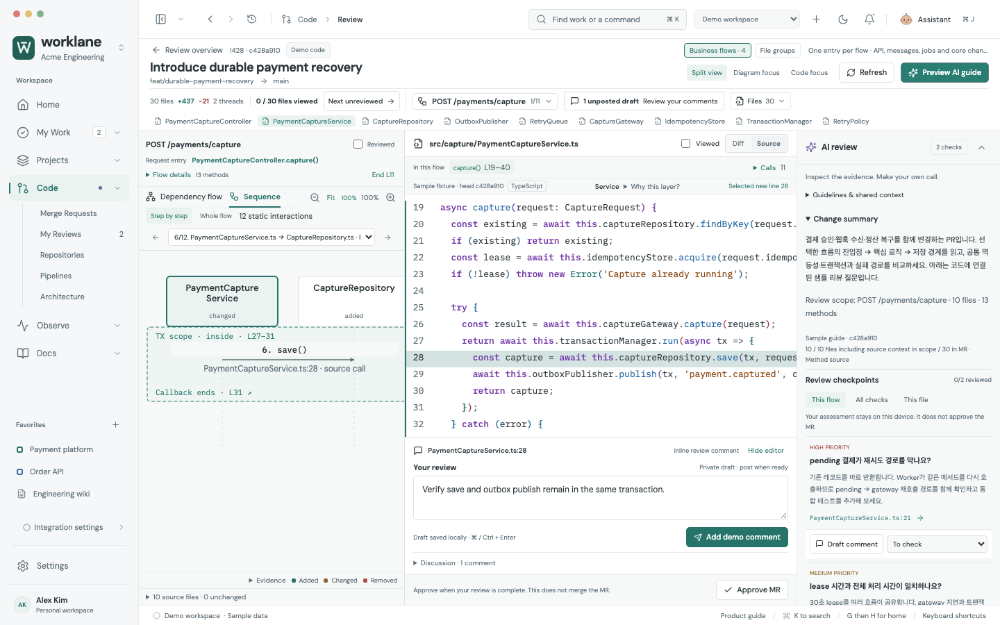

# Complex PR reading review — 2026-10-09

The bounded review found five readability problems and fixed them. Worklane now preserves complete component names and a reading scale while moving between business flows, exact code, AI questions and private comments. The fixtures establish usable navigation and legibility; they are not a user study or proof for every repository.

## Cases exercised

| Case | What was checked |
| --- | --- |
| Payment recovery, 30 changed files, +437 / −21 lines | Capture API, webhook API, retry and reconciliation method flows; shared transactions, idempotency, outbox, tests and configuration |
| Mixed settlement change, 16 changed files plus unchanged source context | Independent API, Kafka, scheduled and core method scopes; domain service, adapters, repository, contracts and type-link disclosure |
| 125 changed files | Last-file search, complete returned-file coverage, deferred local diff failure/retry and draft retention; this fixture checks reachability rather than comprehension of a 125-file business graph |
| 30-node / 40-edge graph | Orthogonal routes, preserved source references, distinct attach points and no rails through unrelated components |
| 1440px and 980px windows, light and dark | Reading scale, full names, code selection, flow-menu bounds, keyboard traversal and comment restoration |

## Problems fixed

- **Lost component identity:** `PaymentCaptureController` became `PaymentCaptureContro…`. Names now wrap at identifier boundaries, preserving every character. Node, band and connector geometry account for the extra lines. Whole-flow sequence participants use the same full-name treatment.
- **Automatic shrinking:** choosing By role in a 980px complex review rendered a nominal 13px label at **9.07px**. Reading mode now stays at **100% / 13px** and uses native panning. Explicit Fit remains an overview action that can reduce the scale.
- **Mixed scope choices:** execution paths and remaining tests/configuration appeared as an undifferentiated list. The 30-file business view now names **4 execution flows and 7 supporting groups**, with labeled sections and a searchable, keyboard-operated chooser. No returned changed-file group is removed.
- **Hidden flow identity on a narrow window:** route and navigation controls squeezed the file-group heading down to `Pay…`. The title and reading path now have their own rows; metadata remains compact underneath.
- **Small Fit target:** the open-chooser accessibility state exposed a 19px-high Fit button. Reading and Fit controls now have at least 24px click targets.

The source graph, call evidence, diff versions, draft keys, review checkpoints and external-write contracts remain canonical. These are presentation and navigation changes.

## Review workflow verified

Select the capture flow → inspect `PaymentCaptureService.ts:28` → write a private comment → examine the webhook flow → return to the exact capture line and the same draft. The sequence identifies the declared **L27–31** transaction boundary around save and outbox publish. AI questions remain scoped to the selected change and link to code; their assessment does not approve the MR.

## Validation and boundaries

- Entire browser regression suite: **396 / 396 passed**. The added regression reproduced lost names and the 9px reading scale before their respective fixes.
- Adapter, parser, model and temporary-Git tests: **172 / 172 passed**.
- Rendered accessibility audit: **25 states**, zero automated WCAG A/AA violations and zero page errors, including the open complex-flow chooser and transaction/comment/AI view.
- Production build and whitespace checks passed. Final focused review tests cover the narrow heading and controls after the last styling adjustment.

Evidence is reproducible with `tests/complex-review-readability.spec.js`, the existing complex/business-flow/transaction suites, and `scripts/audit-design-quality.mjs`. `artifacts/design-quality/report.json` records rendered geometry and accessibility results. Supply `AXE_SCRIPT_PATH` pointing to axe-core 4.11.1 to run the same accessibility checks.

Screenshots use synthetic source and AI guides. Company repositories and live Claude responses were not used. Static calls and inferred relationships are distinguished; dynamic dispatch, reflection, unrecognized frameworks and very large real-world changes still require source inspection. File groups and the complete changed-file navigator remain available when an execution flow cannot be established. The 125-file fixture is not a claim that a 125-file execution graph is readable in one viewport.
