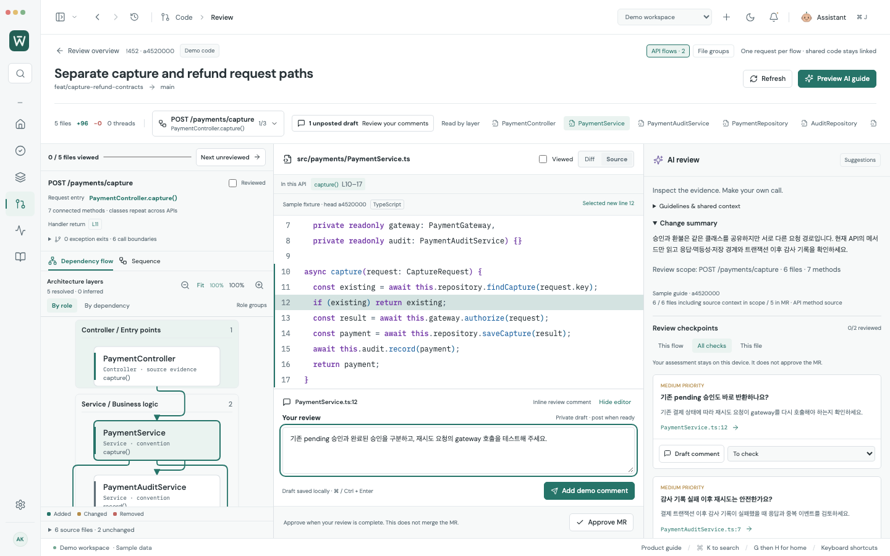
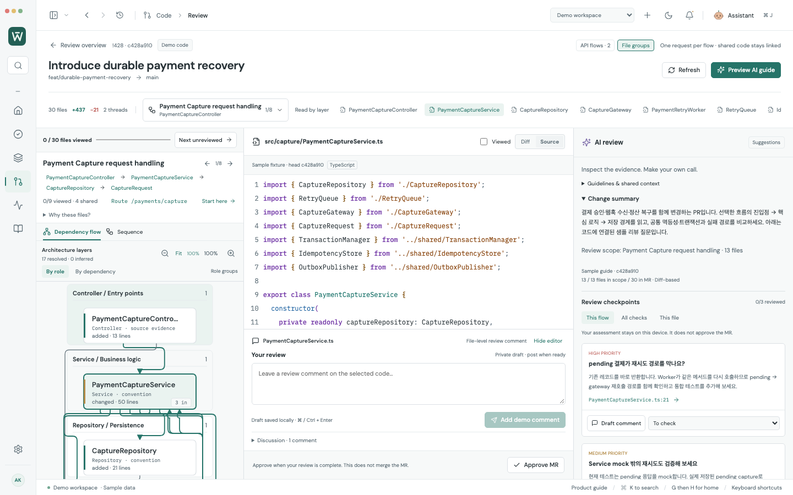
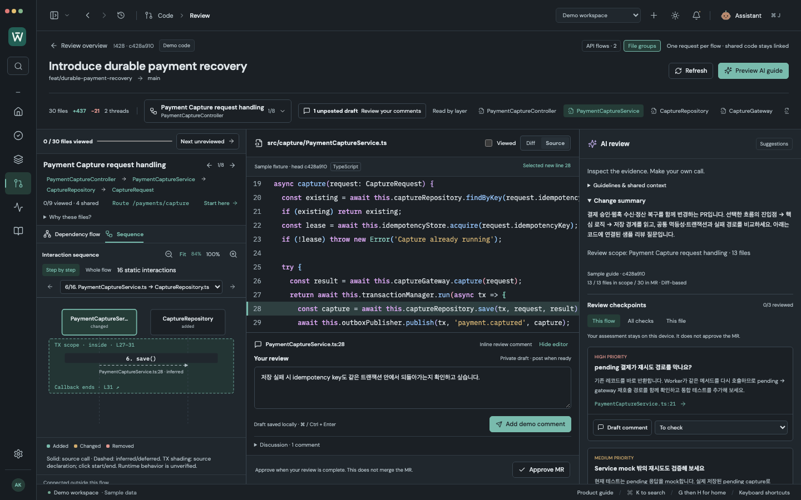

# 리뷰 다이어그램 가독성 개선

2026-10-07. [cathrynlavery/diagram-design](https://github.com/cathrynlavery/diagram-design/tree/d1376371965f513d99cc9ec388835d255c5c88d5)의 디자인 규칙과 architecture·dependency·sequence 예시를 읽고 Worklane의 리뷰 화면에 적용했습니다. 참조 revision은 `d1376371965f513d99cc9ec388835d255c5c88d5`입니다.

## 적용한 규칙과 결과

| 참조 | Worklane에서 바꾼 부분 |
| --- | --- |
| [Architecture 연결선 규칙](https://github.com/cathrynlavery/diagram-design/blob/d1376371965f513d99cc9ec388835d255c5c88d5/skills/diagram-design/references/type-architecture.md) | 연결선을 둥근 직각 경로로 배치합니다. 컴포넌트와 레이어 제목을 장애물로 취급하고, 여러 연결의 접점을 분산합니다. 교차점에는 작은 브리지를 표시해 접합점과 구별합니다. |
| [Style guide의 색과 문자 폭](https://github.com/cathrynlavery/diagram-design/blob/d1376371965f513d99cc9ec388835d255c5c88d5/skills/diagram-design/references/style-guide.md) | 기본 연결선은 차분한 중립색, 선택한 컴포넌트의 연결은 Worklane의 accent로 표시합니다. 한글·CJK를 포함한 이름의 폭을 계산하며 긴 이름은 글씨를 줄이지 않고 생략합니다. 전체 이름과 경로는 title·접근성 이름에 남습니다. |
| [Dependency의 fan-in 표시](https://github.com/cathrynlavery/diagram-design/blob/d1376371965f513d99cc9ec388835d255c5c88d5/skills/diagram-design/references/type-dependency.md) | 두 컴포넌트 이상이 같은 대상을 참조하면 `3 in`처럼 서로 다른 진입 컴포넌트 수를 보여줍니다. 같은 클래스의 여러 메서드 호출을 여러 부모로 세지 않습니다. |
| [Sequence의 라벨과 선 구분](https://github.com/cathrynlavery/diagram-design/blob/d1376371965f513d99cc9ec388835d255c5c88d5/skills/diagram-design/references/type-sequence.md) | 메시지는 `capture()`·`save()`처럼 짧은 호출명으로 표시합니다. 확인된 source call은 실선, inferred/deferred 관계는 점선으로 구별합니다. 코드 경로·행과 전체 메시지는 그대로 확인할 수 있습니다. |
| [레이아웃과 복잡도 관리](https://github.com/cathrynlavery/diagram-design/blob/d1376371965f513d99cc9ec388835d255c5c88d5/skills/diagram-design/references/layout-budget.md) | API별 흐름과 Step by step을 유지합니다. 같은 역할의 API 컴포넌트는 첫 호출의 등장 순서로 배치해 PaymentService 다음에 PaymentAuditService를 읽습니다. 지원 코드·댓글·AI를 옆에서 함께 확인합니다. |

참조한 디자인 원칙을 기존 React/SVG 렌더러에 구현했습니다. Worklane의 색·폰트·정보 밀도를 유지하며, 외부 저장소의 HTML 템플릿이나 JavaScript를 복사해 실행하지 않았습니다. 새로운 dependency는 없습니다.

## 실제 화면

API별 메서드를 읽는 화면:



큰 PR의 공유 의존성 표시:



Source transaction 경계와 리뷰:



위 화면은 실제 앱에서 캡처한 synthetic MR·sample AI guide입니다. 회사 코드와 실제 Claude 응답은 아닙니다. [API 전환 GIF](media/api-flow-review.gif)도 갱신했습니다.

## 검증 및 한계

- 전체 브라우저 **321/321**, adapter/model/Git **159/159**, 실제 Electron connected **11/11 + 6/6** 통과. Production build, native profile/vault/module-worker 검증과 whitespace 검사 통과.
- 새 브라우저 5개는 1440×900·980×650의 light/dark에서 연결선이 다른 컴포넌트와 레이어 문자를 통과하지 않는지, 코드 행으로 이동하는지, 댓글이 유지되는지 확인합니다. 공유 부모 수와 source/inferred 선 구분도 검사합니다.
- 새 로직 7개는 역방향·건너뛴 레이어·자기 참조·공유 접점·30개 컴포넌트/40개 연결, 호출 등장 순서, 문자 폭과 브리지를 검증합니다. 원본 그래프와 code position은 변하지 않습니다.
- UI 캡처 7장과 실제 Electron 검증에서 화면 오류 0. 회사 연동과 실제 Claude 답변 품질은 미검증입니다.

이 다이어그램은 정적 소스 분석을 읽는 도구입니다. 런타임 activation·응답 순서·commit/rollback을 새로 추정하지 않습니다. 원본에 없는 분기 조건이나 return 화살표를 만들지 않습니다. 기존 API 추적의 [지원 범위](API_FLOW_REVIEW.md)는 동일합니다.

직각 경로 검색에는 연결당 20,000개 상태 상한이 있습니다. 배치할 수 없는 연결은 안내를 표시하고, Sequence·원본 코드에서 검토할 수 있습니다. 브리지는 두 선의 직선 부분이 교차하는 곳에 적용하며, 매우 가까운 교차나 코너는 브리지를 생략합니다. 모든 크기와 관계에서 교차가 완전히 없어지는 레이아웃은 보장하지 않습니다.

재현:

```sh
npm run build
npm run test:adapters
npm test -- --workers=5
npm run test:desktop
npm run test:connected-desktop
npm run test:api-flow-desktop
# dev server가 5178에서 실행 중
node scripts/capture-api-flow-review.mjs
node scripts/capture-diagram-design.mjs
```
