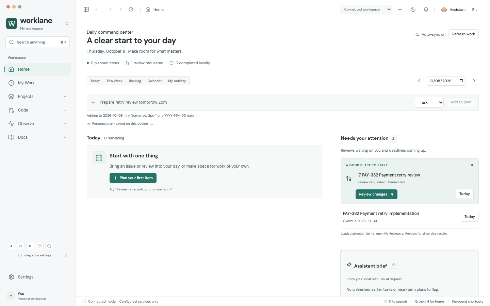
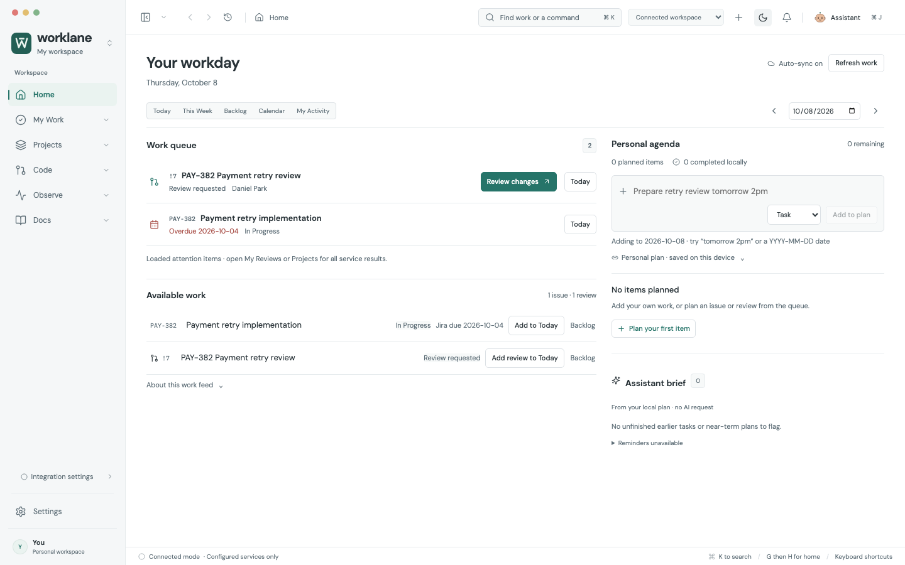
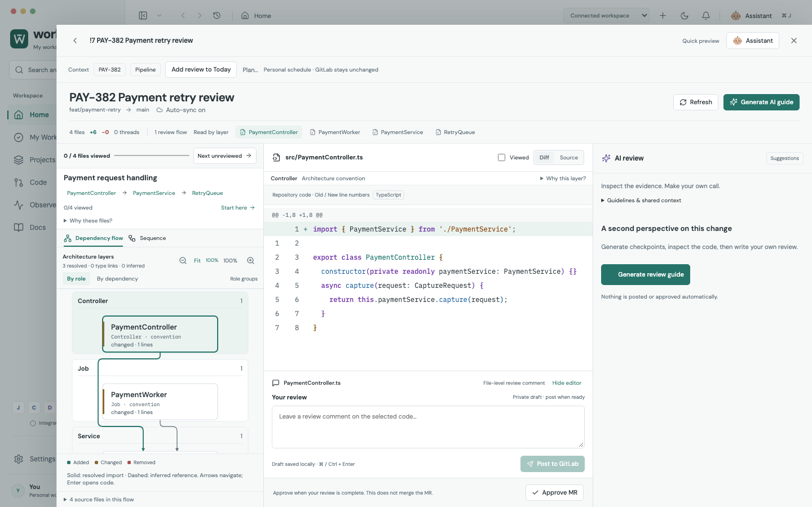
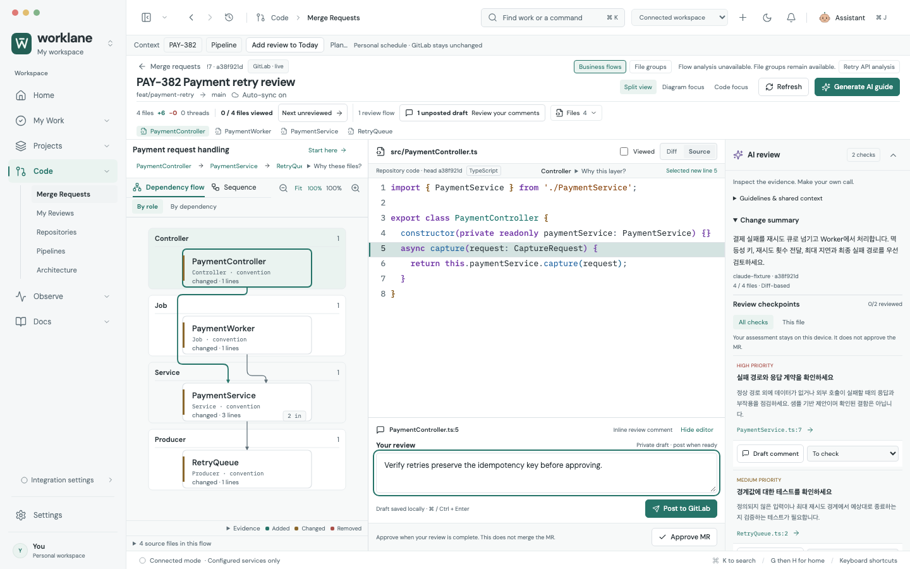

# Worklane flagship work cockpit — 2026-10-08

This redesign makes the linked business task the main working surface. It follows the [brief written before implementation](FLAGSHIP_DESIGN_BRIEF.md). Home, Today, the shell and the MR desk changed substantially; the shared task model, native adapters, commit-scoped source and explicit external-write boundaries remain intact.

Three agents challenged visual hierarchy, daily work and review, then an independent critic checked the implemented pixels and native mouse/keyboard interactions. The critic did not edit the app or tests. The final bounded review found no remaining P1/P2 in Home, shell, MR and quick create; this is not a claim about every organization configuration or every possible repository.

## The working surface

Home puts review requests and Jira deadlines in a compact work queue, with available work underneath. Its personal agenda and quiet brief occupy an independent second column. A long agenda cannot push a short queue into a blank grid row. Today prioritizes the personal timeline over attention. Scheduling, calendar, week and backlog still share one dataset.

The MR desk defaults to diagram and code, with the unrequested AI guide folded away. The human composer opens for a code-line selection, AI draft or explicit Write review. Split, Diagram and Code focus retain code position and drafts; a pipeline round trip restores layout and AI visibility. Complete changed-file search works inside the same desk.

| Measured item | Before | After |
| --- | --- | --- |
| Connected Home's first review action, 1440×900 | Actual work began around y400 | y274 |
| Initial MR preview first code row, 1440×900 | About y393 | y315 |
| MR source share while AI is empty | About 43% | 60% wide / 58% narrow |
| Connected full review, 1440×900 | Repeated chrome and empty AI column | First code row y310; code viewport 473px high; diagram canvas 445px high |
| Complex 30-file review, 1440×900 | Baseline canvas about 151px high | Canvas 442px; code viewport 506px; first code row y277 |
| Source typography | 12px / 25px | 13px / 20px |
| Narrow single-step sequence | Names about 9.5px, call evidence about 6px | Names 13px, call evidence 12px; native panning |
| Workspace rail | 222px; search lost when hidden | 200px; one persistent toolbar search |

Measurements are rendered bounding boxes, not task-completion timings. Initial reading and explicit Fit are different modes: Fit may reduce text for an overview. Larger graphs scroll; a readable whole repository is not promised in one viewport. Static source calls and inferred edges remain distinguished from runtime behavior.

## Findings fixed through repeated review

- Removed generic introductory blocks and duplicate MR identities from the reading path; metadata, layer evidence and boundaries expand locally.
- Used independent Home columns, compact planning actions, and queue → agenda ordering in a narrow sample workspace.
- Kept four small architecture bands readable at the default scale. Single-step sequences use full wrapped participant names and readable call evidence, with exact source navigation.
- Aligned the first automatic Sequence interaction with its actual caller while preserving deliberate source choices. Private DTO drafts remain available after examining an execution message.
- Bounded all-file navigation to the review workspace even after an unposted draft wraps toolbar controls. Mouse selection, ArrowDown and Escape preserve the MR and restore the launcher.
- Made Escape close expanded AI before its containing preview. AI finding selection on narrow screens returns to the source with its guide and draft retained.
- Preserved Code/Diagram focus and manually chosen AI visibility in the context snapshot. Existing per-file, per-line and version-isolated drafts continue to use their canonical records.
- Enlarged AI disclosures and business-flow review checkboxes to usable click targets. Selected line numbers use sufficient contrast in both themes.
- Fixed a real quick-create focus race: delayed title autofocus intercepted body input and appended it to the title. Synchronous, scoped draft restoration prevents a later callback from stealing focus. A controlled regression failed before the fix; repeated and independent keyboard checks passed afterward.

## Verification

| Gate | Result |
| --- | --- |
| Entire browser suite on frozen source | **393 / 393 passed** |
| Adapter, model, parser and actual temporary-Git tests | **171 / 171 passed** |
| Actual Electron connected checks | **11 / 11 passed**; 71 HTTPS fixture requests, actual local Git repository and isolated profile |
| Cold first parser load and draft retention | **2 / 2 passed**, zero unexpected reloads |
| Rendered axe checks | **23 states**, zero automated violations; no page errors |
| Native profile upgrade, encrypted vault, renderer IPC and production parser worker | Passed |
| Production build / diff whitespace check | Passed |
| Independent critic | No remaining P1/P2 in the inspected Home, shell, MR and quick-create paths |

Wide/narrow light/dark captures cover empty AI, expanded AI, code and diagram together, complex file groups, Kafka method flows, sequence, issue inspector, service configuration and long quick-create forms. Shell search was independently tested at 1440, 980 and 860px, including hidden navigation. Quick create additionally exercised held animation frames, delayed configuration, account isolation, 80 paragraphs and close/reopen without publishing.

Native connected checks exercise actual Electron → preload → main adapters, exact Git blobs, one preparation for a new revision, zero automatic external writes and zero GitLab diff/raw-code requests. Service responses and Claude output are fixtures. They do **not** prove access to real Jira workflows, self-managed GitLab policies or the quality of a live Claude response.

The screenshot audit's machine report is generated at `artifacts/design-quality/report.json`. Reproduce it with `scripts/audit-design-quality.mjs`; set `AXE_SCRIPT_PATH` to a locally installed axe-core 4.11.1 script to include WCAG A/AA checks. `tests/capture-home-cockpit.mjs` records sample personal plans. `scripts/capture-readme.mjs` and `scripts/encode-readme-gifs.py` record and encode real interactions rather than invented frames.

This is an improved early preview, not a signed store release. Company account permissions, live Claude quality, manual assistive-technology testing, Windows/Linux native behavior, signed installers, distribution and updates remain unverified release work. No market attention or adoption result has been measured.
