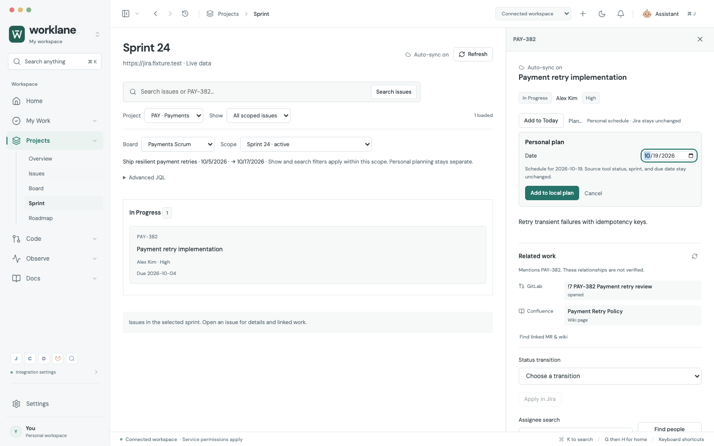

# Jira workflow usability

The connected workspace uses ordinary issue search and visual project/work filters. There is no query editor or advanced-query mode. Issue inspection, comments, and linked work stay open when switching project views or filters.

This screenshot uses isolated fixture data rendered by the actual app. It is not a company-account connection.

## Problems corrected

| Before | Now |
| --- | --- |
| Finding personal/project work required writing JQL. | Search by issue key or words; project and Recent/Open/Assigned to me/Due soon/Active sprint filters produce server queries. |
| Sprint could only show the union of every open sprint. | Project → Scrum board → specific active/future sprint or actual board backlog establishes the server scope. Personal work/search filters intersect that scope. |
| Board/view/filter changes discarded the issue inspector. | The inspector and unsaved due/assignee/comment edits remain mounted across project views and filters. |
| Changing a status required opening an issue. | A row popover fetches allowed Jira transitions and writes only when **Apply** is clicked. Escape/outside-click cancels the popover. |
| A failed first-page query could leave the old next-page token paired with the new query. | Only a successful request replaces the applied query. Previous rows/pagination remain tied to their original query after failure. |
| Unchanged assignee/due/priority fields could be repeatedly saved. | Save buttons activate only for changes. Writes remain explicit. |
| Sprint/priority required expanding and then manually loading options. | Expanding loads options; **Refresh project options** retries them. A failed board request does not discard successfully loaded priority choices. |
| Add-to-Today could silently move already scheduled linked work. | Canonical linked work shows its current date/time, **In Today**, or explicit **Move to Today**. Local undo restores only the unchanged moved task. |
| Comments lacked keyboard posting and feedback appeared below the full inspector. | Cmd/Ctrl+Enter posts explicitly; sticky success/error feedback stays visible. Subtasks open through the retained context stack. |
| Narrow split views could crush issue titles into very small columns. | Compact rows and a minimum table width preserve readable titles through horizontal scrolling; table text follows theme colors. Settled light/dark rendering was inspected. |

## Practical scope

- Filters execute Jira queries; visible counts describe **loaded** results and advertise additional pages. Board counts never claim full-project totals before all pages are loaded.
- The Roadmap screen describes its implemented behavior as **Issue deadlines**. It orders due dates and does not claim to infer epic dependencies or a full Jira roadmap.
- Scrum board and sprint options support offset pagination with explicit Load more controls in both the workspace and inspector. Project discovery supports server-side name/key search and offset pagination through **Find project** and **Load more projects**. Selected projects remain available while searching for other projects. Failed searches retain existing options and retry the intended request.
- Sprint membership comes from the Agile issue endpoint independently of the issue body. Slow or rejected membership reads do not block reading, commenting, or status changes. Accepted sprint moves consume their target selection, including when the follow-up read fails.
- When a newly selected sprint query fails, cached display labels explicitly identify the previous loaded board/sprint. Refresh and pagination stay on that previous successful scope; Retry selected query retries the intended target.
- Status transitions that require unsupported Jira screen fields are disabled with an explicit Open in Jira recovery action. No guessed required values are posted.
- Personal **Plan…** scheduling chooses a date or backlog for the same canonical linked task. The compact form autofocuses its date and closes with Escape. A schedule move offers guarded Undo. Personal planning does not change Jira sprint/status/due dates or post GitLab review comments.
- Assignee search retains the selected candidate while loading new candidates, keeping the visible selection aligned with the submitted account ID. Accepted comments clear their matching saved draft even if the inspector was closed while posting.
- Related GitLab/wiki results retain their existing “mentions, not verified relationships” disclosure.
- Extra required fields on Jira creation retain the adapter's explicit create-in-Jira recovery path. URL/token configuration and real company-account permissions remain unverified here.

## Verification

`tests/jira-usability-improvements.spec.js` covers 17 browser cases: server filter construction, selected active sprint scope, retained drafts, inline writes/cancellation/retry, failed-query pagination and persistent mismatch disclosure, unsent search, subtasks, partial planning/status metadata failure, superseded status retry recovery, accepted-write refresh recovery, keyboard comments, narrow dark view, and canonical issue/MR scheduling with guarded undo.

`tests/jira-planning-review.spec.js` adds 11 practical planning cases: future sprint/backlog intersection, Unknown status, assignee selection consistency, accepted comment after close, accepted sprint move with optional metadata failure, required-screen transitions, canonical date/backlog planning, option pagination, delayed membership, failed-scope loaded-page recovery, and stale board options.

The focused Jira browser set passed 28/28. The wider connected/context/Jira set passed 53/53 before the final scope-label disclosure adjustment; the final 11-case planning set was rerun after that change and the compact date chooser refinement.

`tests/integration/jira-workspace.test.mjs` passed 4/4, checking sprint scope, safe literals, personal/due filters, and endpoint-scoped sprint intersection.

Existing connected workflow, automatic synchronization, comment draft, and retained-context suites were rerun. The tests use deterministic browser fixtures; real Atlassian accounts and live permission configurations are outside these checks.

This screenshot uses the actual renderer at 1440 × 900 with isolated fixture data. The same workflow was inspected at 1100 × 900 in dark mode without document-level horizontal overflow.

## Visual filtering follow-up — 2026-10-08

- Removed the advanced query editor, custom-query state, obsolete styles and query-language recovery instructions from the product UI. The adapter still generates the query required by Jira internally.
- **Show** offers Recent work, All work, Open work, Assigned to me, Due soon and Active sprint. **Filters** reveals status groups, Anyone/Assigned to me/Unassigned, and overdue/today/next-three-days/current-week/no-deadline choices. A choice applies immediately; it overrides only its corresponding preset dimension, so Done with Assigned to me never produces contradictory open-and-done constraints.
- Removable condition chips and **Clear filters** show what is selected. Reset keeps the chosen board/sprint on the Sprint screen. Search remains explicit via Enter or **Search issues**; changing another filter, switching views and automatic synchronization never submit unfinished search text.
- Exact issue-key search bypasses the recent-update cutoff while retaining explicit project/status/assignee/deadline conditions. Ordinary word search keeps the selected view's date scope; use **All work** to include older work.
- Project lookup follows the [Atlassian paginated project search contract](https://developer.atlassian.com/cloud/jira/platform/rest/v3/api-group-projects/#api-rest-api-3-project-search-get), with query/offset parameters and request-generation protection. Projects outside the first page remain reachable without a query language.
- Escape closes filter/project disclosure and restores trigger focus; outside click dismisses it. At 980px, the issue inspector stays beside the list so it cannot cover filter controls. Narrow filter content expands inline and preserves readable table columns through table scrolling.

Verification: **40/40** focused browser cases, **171/171** model/adapter/Git tests; final full-suite and native results are recorded in [development history](LOCAL_DEVELOPMENT.md). Six new browser regressions cover combined conditions, independent removal, reset, inspector draft retention, project search/pagination/retry, sprint containment and the 980px dark layout. The two actual app captures use isolated fixtures and record zero page errors. No company-account compatibility is claimed.

