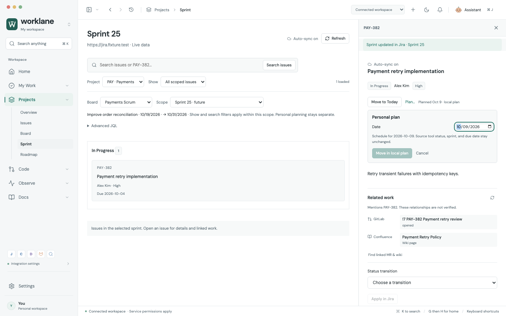
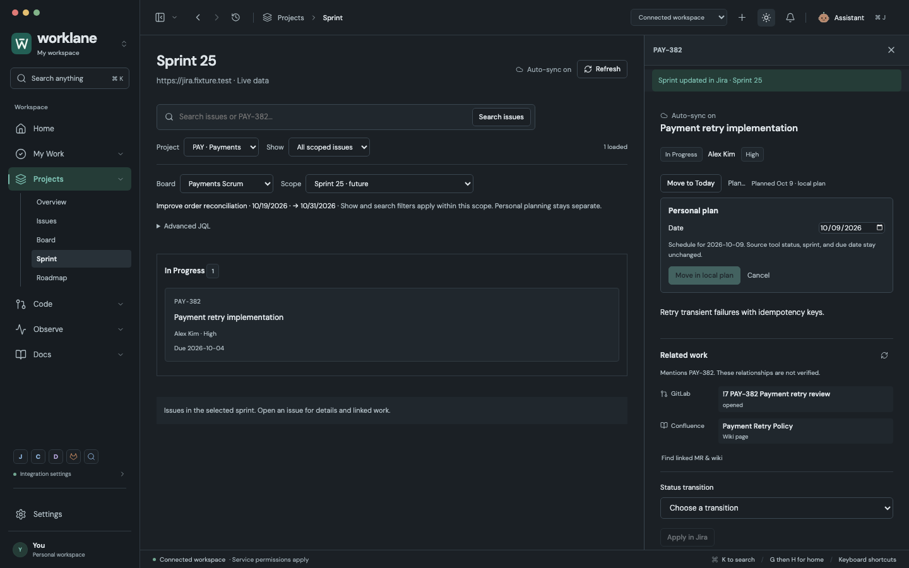

# Daily, weekly and sprint planning: practical review

This review follows the connected implementation, using local fixture accounts and the actual renderer. Personal plans use one local dataset; Jira sprint membership, status, assignee and due date remain external fields changed only by explicit submission.

## Round 1: independently reproduced problems

| Workflow | Problem | Correction |
| --- | --- | --- |
| Calendar → sidebar Today | A future calendar date survived entry to Today and hid today's tasks. | Today entry returns to the current day; calendar and week ranges have their own remembered positions. |
| Delete linked task → add again → Undo | The removed and replacement records could become two unfinished copies of the same linked work. | Undo detects the replacement and preserves its plan. The model rejects new unfinished duplicates, including reopening completed work. |
| Review requests → weekly plan | Counts included MR requests while weekly/calendar available work omitted them; Home hid requests after the fifth row. | Loaded reviews have direct scheduling actions, and attention has progressive expansion with loaded-result coverage. |
| End of day → Tomorrow | The row action removed work from the current date without schedule recovery. | Tomorrow uses the same guarded undo as drag and bulk scheduling. |
| Untimed task dragged above a timed item | Stored order changed while the chronological display appeared unchanged. | Different time groups retain chronological order with an explanation; equal-time groups can be reordered. |
| Quick add exact Jira key | A loaded issue key produced an unrelated personal task. | An exact loaded key schedules its canonical linked work; other text remains a personal task. |
| Jira deadline → personal week | Planning after a Jira deadline had no visible conflict. | Read-only due badges and warnings distinguish external deadlines from personal scheduling. |
| Sprint planning | A union of every open sprint could not show the next sprint or a specific board's backlog. | Board and active/future sprint selection establish a specific server scope; personal filters intersect that scope. |
| Assignee selection → another search | Search removed the selected candidate from the native options, while Save retained its hidden account ID. | Selected people remain visible independently of subsequent search results. |
| Post comment → close inspector | An accepted comment reappeared as an unsent draft and invited duplicate submission. | Accepted submission clears only the matching captured draft, even after closing the inspector. Newer text is retained. |
| Accepted sprint move | The same target remained ready to submit, and current membership was not read. | Accepted targets are consumed; independent Agile membership reads display the current sprint and have read-only recovery. |
| Board issue with missing status | The issue was counted but disappeared from all columns. | Grouping and filtering use the same Unknown fallback. |
| Status requiring extra fields | Unsupported transition screens submitted a guaranteed incomplete request. | Transition metadata identifies required fields and provides explicit Jira recovery instead of sending an incomplete change. |

## API contracts

Board-scoped sprint and backlog reads use the enhanced token-paginated Jira Software Cloud routes. Current sprint membership uses the independent Agile issue endpoint, avoiding guesses about tenant-specific custom field IDs. A membership failure does not discard the readable issue body.

Primary references: [Atlassian board APIs](https://developer.atlassian.com/cloud/jira/software/rest/api-group-board/), [Agile issue fields](https://developer.atlassian.com/cloud/jira/software/rest/api-group-issue/), [transition metadata](https://developer.atlassian.com/cloud/jira/platform/rest/v3/api-group-issues/).

The explicit Open in Jira action can open only an issue browse URL at the configured HTTPS site. It does not accept arbitrary renderer URLs or navigate the embedded application away from its context.

## Validation boundary

Company credentials, live permissions and production records are not used in this review. Dooray remains a menu/mock integration. These checks establish local behavior and API request contracts, not production integration certification.

## Rounds 2 and 3

Independent cross-review replayed the same practical scenarios after the first repairs. It found one remaining scope ambiguity: selecting Sprint 25 after its query failed retained Sprint 24 rows while the heading/footer described the selected sprint. The UI now explicitly names both the loaded and selected board/sprint scopes. Refresh retains every previously loaded page; Retry selected query uses only the new scope, with no old cursor. A third direct UI replay verified the correction.

The final independent reviews found no reproducible remaining Critical/P1/P2 issues within the reviewed daily, weekly, sprint and Jira mutation/handoff scenarios. This is a bounded review result, not a claim that every possible tenant workflow is supported.

## Final verification — 2026-10-07

- Repository-wide browser suite: **280/280 passed**, including **24 new practical planning regressions**.
- Adapter/model suite: **110/110 passed**, including enhanced Software endpoints, optional Agile fields, transition metadata, scoped Cloud ID routing, pagination and constrained external recovery URLs.
- Actual Electron connected workflow: **11/11 passed**, **71 fixture requests**, **zero renderer errors**, zero automatic external writes. Native checks include specific active/future sprint and real board backlog request paths.
- Native profile compatibility, OS-encrypted credential vault, and **5/5 assistant memory lifecycle checks** passed.
- Production build and whitespace checks passed. The existing bundle-size advisory remains; it is not a failed build.
- Independent direct browser review: five scenario groups plus **13/13 targeted cases**; another reviewer separately passed **5/5 Jira mutation and planning handoff scenarios**. All used fixture data.
- Screens opened and inspected at desktop light/dark and narrower 980–1100 pixel layouts. Manual in-app checks also verified same-view Today navigation and Tomorrow → Undo.

Focused failures caused by changed selectors/preview wording and Vite HMR test-module identity were repaired in the test harness; final results above come from the complete clean run against frozen product code.

Reproduce the screenshots with `node scripts/capture-planning-review.mjs` while the local development server runs at port 5178.

