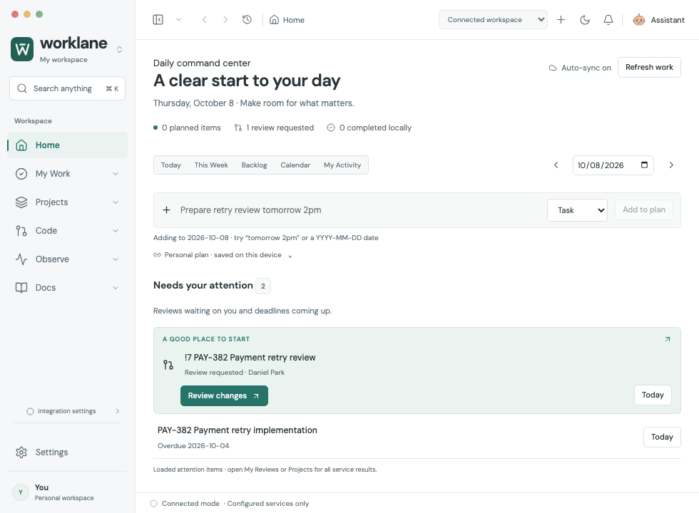
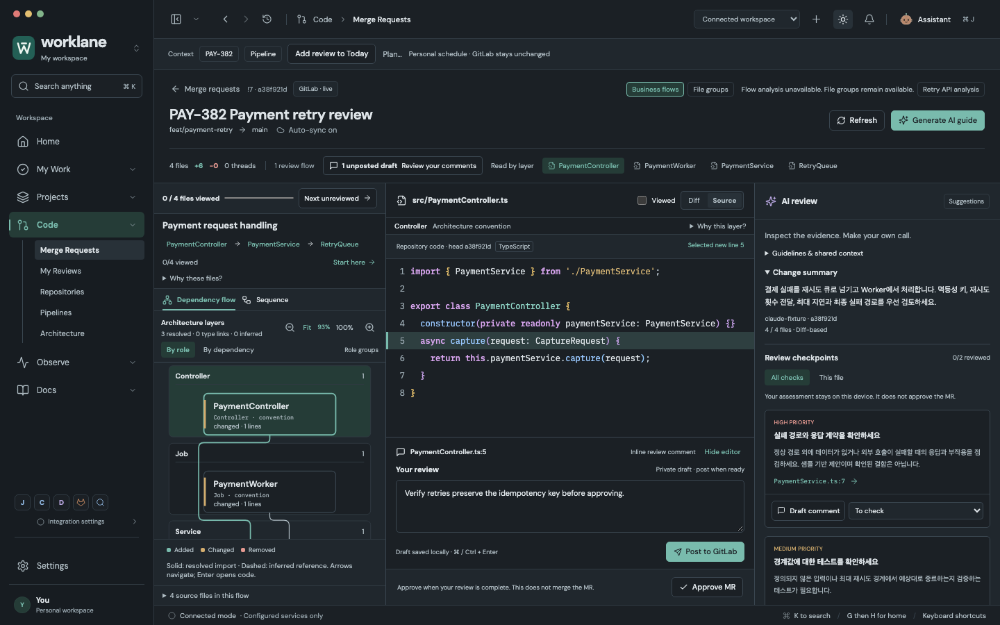
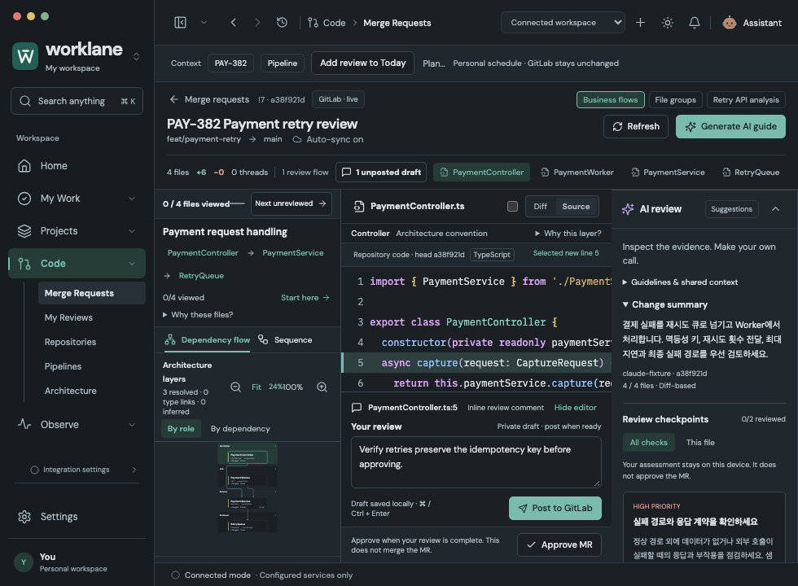
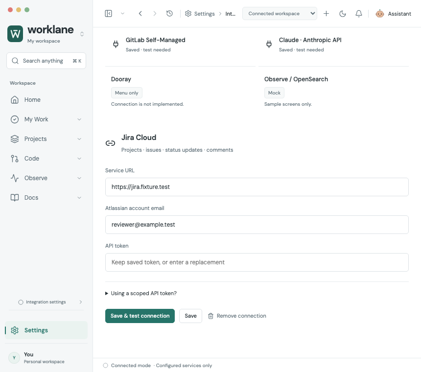
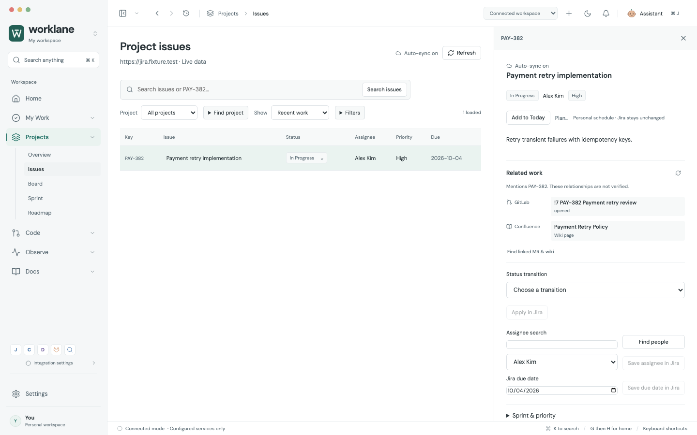
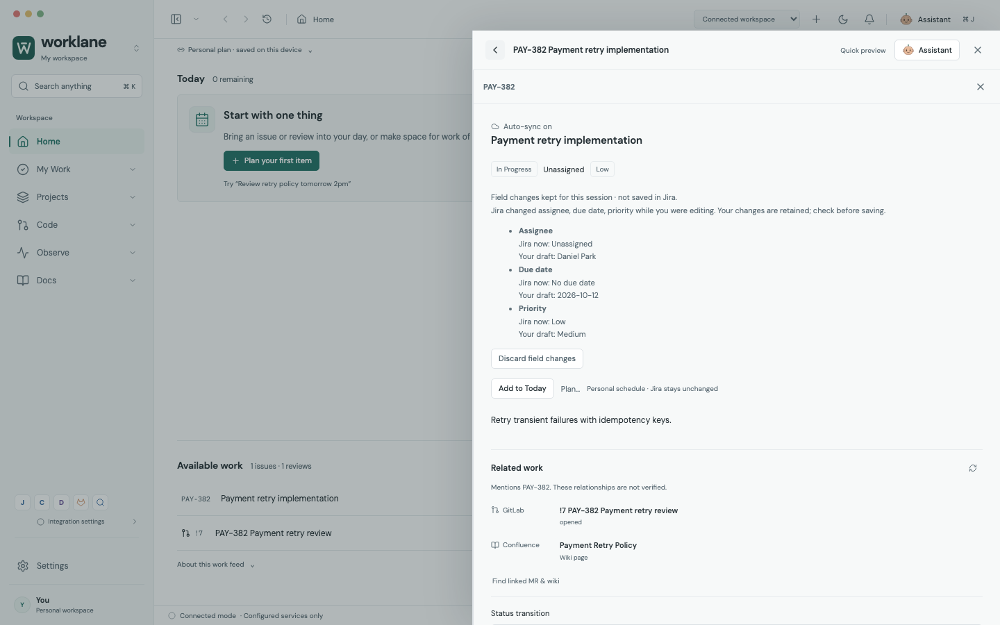

# Design and interaction release review — 2026-10-08

This review challenged the existing product from three independent perspectives: first use and trust, visual hierarchy and density, and repeated work with interrupted context. Reviewers first inspected the running app, owned separate fixes, then cross-reviewed another reviewer's work. Root integration changes were independently challenged as well. Company accounts and personal browser sessions were not used.

## Findings and resulting behavior

| Finding | Result |
| --- | --- |
| Review requests fell below the first fold of an empty 980px daily plan. | Home/Today place attention before planning at narrow widths; wide views keep the plan and attention side by side. Empty planning is compact. |
| Notification switches promised behavior they did not perform. | Three concrete switches control review attention, issue deadline attention, and the Home brief. They apply across Home, Today and the bell. Available work and source lists remain available. They do not mute Jira/GitLab notifications. |
| Navigating out of Settings discarded unsaved credentials. | Service forms survive tabs and navigation in volatile renderer memory. Unsaved indicators, explicit cancel, and distinct save versus verification outcomes clarify what happened. Reload intentionally clears secrets. |
| Connect actions opened the wrong provider, and narrow service selection left inputs offscreen. | Empty-screen actions open the relevant service; narrow selection focuses the form heading, and Tab reaches its URL input. |
| Jira field drafts disappeared after reading linked documentation. | Due date, assignee and priority drafts survive a retained context round trip. A changed server baseline displays Jira now / Your draft; discard restores current values without deleting the comment draft. |
| A current priority omitted from allowed metadata appeared blank. | The current value is displayed explicitly. A no-longer-allowed draft remains identifiable and cannot be submitted. |
| Empty AI content consumed narrow review space; Fit shrank itself after a delay. | Empty AI folds until requested. Expanded AI, diagram and code share the full review height. The diagram viewport has stable flex sizing independent of SVG dimensions. Fit scales both axes; 100% restores reading detail and scrolling. |
| Source file lists consumed diagram space. | A compact source-file disclosure opens a local list. Selection returns to the diagram/code; Escape closes the disclosure before the containing context. |
| Initial connection loading failure could leave a permanent spinner. | A local error view offers Retry connections and the relevant settings destination. |
| Several light-theme labels and small controls were hard to read or hit. | Muted/semantic tokens, sidebar options, diagram percentage and flow-link targets were corrected. The 860px toolbar truncates secondary breadcrumb text while retaining primary actions. |
| Interactive SVGs were declared as static images. | Diagrams expose a named group containing their code-navigation buttons. Keyboard behavior and source-evidence labels are retained. |

## Actual app captures

These are Chromium-rendered app pixels with synthetic fixtures. They are not concept images or evidence of live Claude accuracy.















## Reproduce

```sh
npx playwright test tests/release-*.spec.js --workers=4
node scripts/audit-design-quality.mjs
```

The capture script owns its ephemeral Vite server and isolated browser. It writes screenshots and a report under `artifacts/design-quality/`. To include axe rules, provide an externally installed, pinned axe script; the application gains no runtime dependency:

```sh
npm install --prefix /tmp/worklane-axe axe-core@4.11.1 --no-save --package-lock=false
AXE_SCRIPT_PATH=/tmp/worklane-axe/node_modules/axe-core/axe.min.js node scripts/audit-design-quality.mjs
```

The automated checks use WCAG A/AA rule tags through 2.2. Their purpose is to catch concrete contrast, target and semantic regressions. [Minimum contrast](https://www.w3.org/WAI/WCAG22/Understanding/contrast-minimum.html) and [minimum target size](https://www.w3.org/WAI/WCAG22/Understanding/target-size-minimum.html) informed these repairs. Automated checks and fixture screenshots do not establish complete WCAG compliance.

## Release boundary

Final validation: **377/377 browser tests**, **171/171 adapter/model/Git tests**, **11/11 actual Electron connected workflows**, and **2/2 cold-start review checks** passed. Production build, native profile compatibility, encrypted credential storage, and production parser-worker checks passed. The native connected run recorded 71 synthetic HTTPS requests, zero renderer errors and zero automatic external writes. Ten rendered screen/theme/width states produced zero automated axe violations and zero page errors.

Independent cross-review found additional regressions in delayed diagram fitting, AI-expanded diagram clipping, and current-priority metadata omission. They were repaired and independently rechecked. The final reviewers identified no remaining reproducible Critical/P1/P2 within the audited paths. This is bounded evidence, not a claim of defect-free software. The prior stacked-AI layout assertions were changed to assert the new full-height, side-by-side layout; the other keyboard, draft, source selection and mutation assertions remain.

The four release regression files add 26 checks: onboarding (6), home hierarchy/preferences (6), context field drafts (10), and design geometry/recovery (4). The diagram geometry checks deliberately wait beyond the ~400ms failure window; immediate snapshots had missed the Fit feedback loop. The CI workflow now repeats the rendered accessibility audit with isolated axe-core 4.11.1.

The audit covers developer workflows at 1440×900, narrow review/planning at 980×650–720, and connection forms/toolbar at 860×760. An explicit Fit is an overview; reading tiny code or graph text still uses 100% and local scrolling. Observe remains a mock, Dooray remains a menu placeholder, and model output is a fixture in these checks.

App-store release additionally requires packaging/signing, supported operating-system verification, real organization access/permission checks, live provider validation, and manual assistive-technology testing. This work evaluates design and interaction quality; it does not certify those unperformed release requirements.
