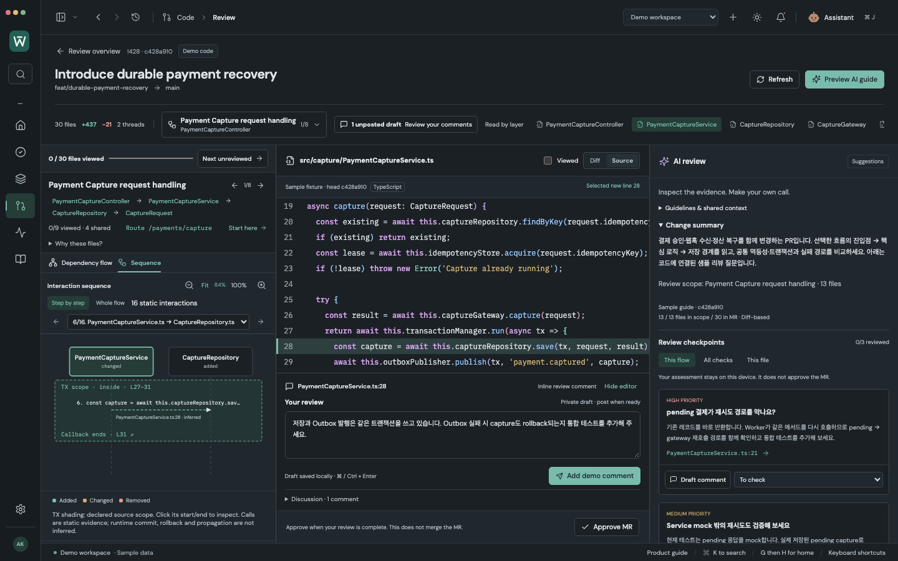
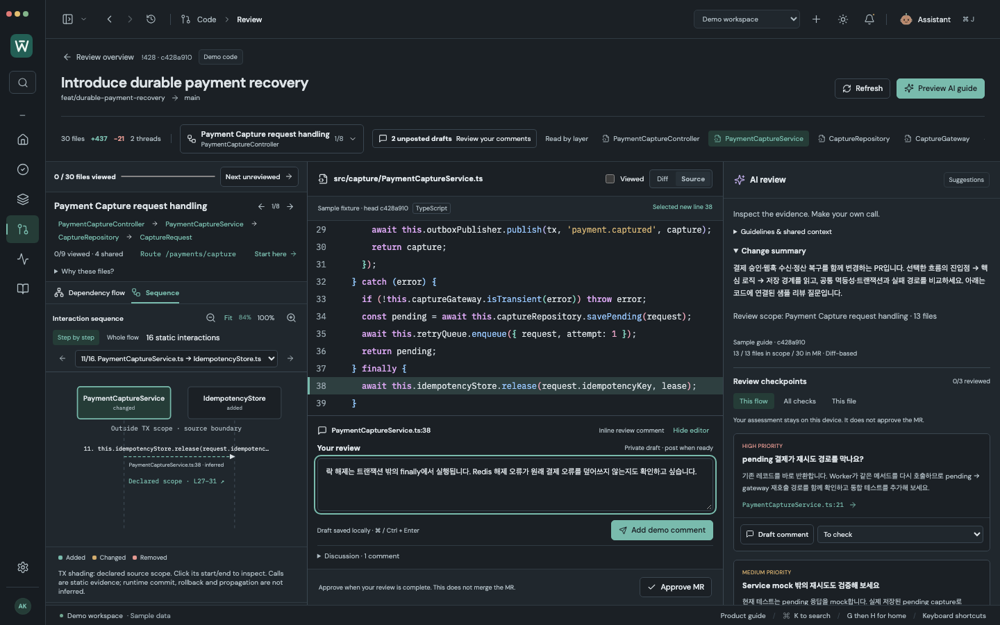

# Transaction boundaries in sequence review

The sequence, code and AI checkpoints remain in the same workspace. Whole flow wraps recognized source scopes in a labeled TX region. Step by step shows **TX scope · inside**, **Outside TX scope**, or an explicit unavailable/boundary state. Click a region's start or end (or press Enter/Space) to select the exact head-source line without replacing the current interaction or private review draft.

In synthetic MR !428:

| Flow | Declared source scope | Inside | Outside |
| --- | --- | --- | --- |
| Capture | PaymentCaptureService.ts:27–31 | Capture save and Outbox publish | Gateway request, retry scheduling, lease release |
| Webhook | PaymentWebhookService.ts:16–21 | Deduplication, status update, event record and Outbox | Signature validation and lease release |
| Reconciliation | ReconciliationService.ts:20–23 | Settlement update and Outbox | Cursor advancement |

## Evidence and limits

This is bounded static source navigation, not a transaction monitor or an AST-based whole-repository analysis. A shaded region means the call sits inside a recognized declaration in its **own source file**. It does not prove a callee participates, a branch executes, or a database commit/rollback succeeds. “Outside” means outside the recognized lexical scope; an ambient transaction may still exist.

- Full, non-deleted head source up to 200,000 characters is required. Partial/disconnected hunks never synthesize a scope. Opening full Source lets the diagram use the exact cached head revision; there is no additional code API polling.
- Recognizes block-bodied arrow callbacks to `$transaction`, and `transaction` on common db/database/prisma/sequelize/knex receivers. These API spellings are source evidence, not runtime type verification.
- Custom TypeScript wrappers require an exact relative named import, typed instance property and a directly forwarded callback in the imported class's method. Arbitrary `run()` methods, another class's methods, mixed helper bodies and unresolved wrappers stay unclassified. The fixture resolves TransactionManager.run to its actual forwarding method.
- Recognizes Java method `@Transactional` declarations with the exact Spring import. Class annotations, Kotlin, aliases, arbitrary frameworks, dynamic dispatch, callbacks declared elsewhere and complex signatures are not resolved. NOT_SUPPORTED/NEVER/SUPPORTS declarations are excluded from positive scope detection.
- Comments, literals and regex bodies cannot create callback boundaries. Nested callbacks retain distinct ranges; Whole flow nests regions, while Step by step labels the innermost range as nested.
- A boundary line containing multiple statements is shown as a boundary to inspect, rather than claiming every statement is transactional. Resolved wrapper entry calls can be located exactly.
- AI cannot fabricate a transaction region. Propagation, proxy/self invocation, savepoints, isolation, cross-file runtime context and commit/rollback results are deliberately not inferred.

Source semantics were checked against [Spring's annotation documentation](https://docs.spring.io/spring-framework/reference/data-access/transaction/declarative/annotations.html) (annotations require runtime infrastructure; proxy self invocation is special) and [Prisma's transaction documentation](https://www.prisma.io/docs/orm/fundamentals/transactions) (interactive transactions use callbacks). These do not establish the behavior of company repositories.

## Validation — 2026-10-07

- Browser regression: **307/307** checks, including all three flows, both themes, keyboard boundary actions, exact head-source lines, private draft retention, whole-flow framing and 1440×900 / 980×650 layouts.
- Adapter/model: **133/133** checks, including nine scope-specific tests for actual fixture ranges, nesting, misleading comments/strings, partial/deleted/oversized source, unclosed blocks, unresolved/incorrect wrappers, Java annotation provenance and ambiguous boundary lines.
- Native connected Electron: **11/11** workflow checks using fixture HTTPS responses and real temporary Git repositories; zero renderer errors. These are connected-mode regression checks, not a company-service test.
- After final nested-frame sizing and nearest-scope refinements, **15/15 affected browser checks** and **9/9 transaction model checks** passed again.
- Production build and whitespace checks pass. Three 1440×900 screenshots have zero page errors. Manual in-app inspection confirmed start/end jumps and the whole-flow region.

Reproduce screenshots with `node scripts/capture-transaction-review.mjs` while Vite runs at port 5178. The actual app uses synthetic source, sample AI checkpoints and private demo drafts; the capture does not alter presentation styles.
